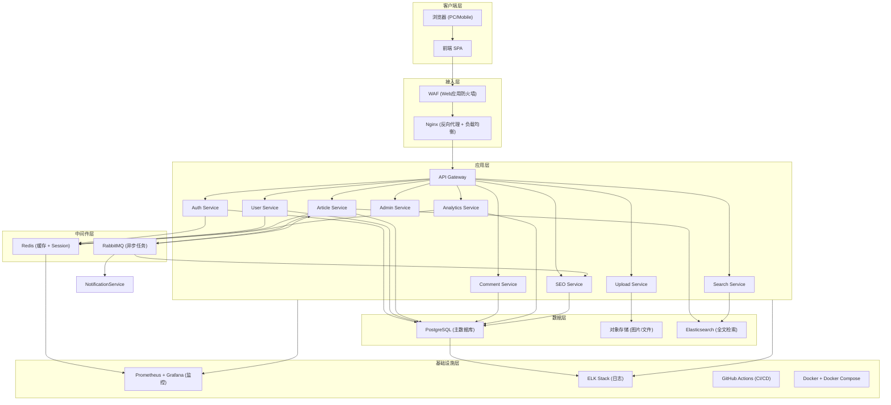
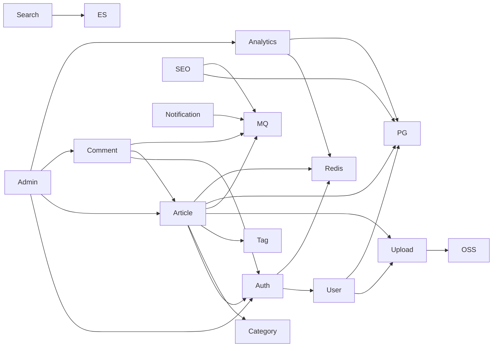
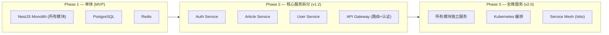
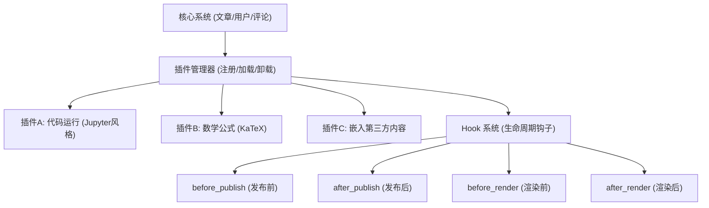

# 博客系统架构设计文档

**文档版本：** v1.0  
**撰写日期：** 2026-06-27  
**撰写人：** 架构师 · 高见远  
**文档状态：** 待评审  

---

## 目录

1. [总体架构](#一总体架构)
2. [技术选型](#二技术选型)
3. [模块划分](#三模块划分)
4. [权限模型](#四权限模型)
5. [系统安全](#五系统安全)
6. [系统扩展性](#六系统扩展性)

---

## 一、总体架构

### 1.1 系统架构图



### 1.2 数据流说明

| 请求类型 | 资料流路径 | 关键环节 |
|---------|-----------|---------|
| 读者浏览文章 | Browser → SPA → Nginx → API Gateway → Article Service → PG/Redis → 返回渲染页面 | Redis 缓存热点文章 |
| 作者发布文章 | Browser → SPA → Nginx → API Gateway → Auth Service（验证JWT）→ Article Service → PG（写入）→ MQ（异步任务）→ ES（索引更新）→ SEO Service（sitemap更新） | 发布触发3个异步任务 |
| 图片上传 | Browser → SPA → Nginx → Upload Service → OSS（直传或代理上传）→ 返回 URL | 大文件考虑客户端直传 OSS |
| 搜索文章 | Browser → SPA → Nginx → Search Service → ES → 返回结果列表 | ES 分词+相关性排序 |
| 统计阅读量 | Browser → SPA → Nginx → Analytics Service → Redis（计数）→ MQ → PG（持久化） | 写操作异步化 |

### 1.3 核心设计原则

| 原则 | 说明 |
|------|------|
| **读写分离** | 读操作优先走 Redis 缓存，写操作直接写 PG，异步更新缓存 |
| **异步优先** | 非实时性任务（sitemap更新、ES索引、阅读量持久化）通过 MQ 异步处理 |
| **CDN 加速** | 静态资源（前端SPA、图片）通过 CDN 分发，减少服务端压力 |
| **渐进演进** | MVP 期使用单体架构，预留模块边界，未来可拆为微服务 |

---

## 二、技术选型

### 2.1 Frontend（前端）

| 领域 | 选择 | 理由 |
|------|------|------|
| **框架** | **React 18** | ① 社区生态最大，组件库丰富；② SSR 支持（Next.js 可选升级）；③ 团队技术栈覆盖率高 |
| **UI 库** | **MUI (Material UI)** | ① 设计规范完善，视觉一致性强；② 主题定制能力强（暗色模式）；③ 组件覆盖广（表单/表格/对话框等） |
| **状态管理** | **Zustand** | ① 比 Redux 更轻量，代码量减少70%；② 无 Provider 包装，使用简单；③ 支持中间件和持久化 |
| **构建工具** | **Vite** | ① 开发启动速度比 Webpack 快10倍+；② HMR 即时热更新；③ 生产构建使用 Rollup，包体积更小 |
| **CSS 方案** | **Tailwind CSS** | ① 原子化CSS，快速构建页面；② 与MUI互补（MUI管组件，Tailwind管布局）；③ 减少自定义CSS体积 |
| **Markdown 渲染** | **react-markdown + remark-gfm** | ① 支持 GFM 扩展（表格/任务列表）；② 插件生态丰富；③ 安全性可控（可禁用危险HTML） |
| **代码高亮** | **Prism.js** | ① 语言覆盖广（200+）；② 主题丰富；③ 轻量（按需加载语言包） |

---

### 2.2 Backend（后端）

| 领域 | 选择 | 理由 |
|------|------|------|
| **语言** | **Node.js (TypeScript)** | ① 前后端语言统一（React + Node），降低团队技术栈宽度；② TypeScript 提供类型安全；③ I/O密集场景性能优秀 |
| **框架** | **NestJS** | ① 模块化架构（Module/Controller/Service），天然映射业务模块；② 依赖注入（DI），代码解耦；③ 内置 Guards/Interceptors/Pipes，权限和校验开箱即用 |
| **API 规范** | **RESTful API** | ① 前端对接直观；② SEO 友好（文章页面可 SSR）；③ MVP 期足够，未来可补充 GraphQL |

---

### 2.3 Database（数据库）

| 领域 | 选择 | 理由 |
|------|------|------|
| **数据库** | **PostgreSQL 16** | ① 全文检索内置（ts_vector），MVP期可替代ES；② JSONB 支持灵活字段（社交链接等）；③ 性能和功能远超 MySQL，尤其复杂查询和并发写入；④ 扩展生态丰富（pg_trgm, pg_stat_statements） |
| **ORM** | **Prisma** | ① 类型安全的 Schema 定义，自动生成类型；② 迁移管理自动化（prisma migrate）；③ 查询构建直观，减少手写SQL；④ 与 TypeScript 完美配合 |

---

### 2.4 Cache（缓存）

| 领域 | 选择 | 理由 |
|------|------|------|
| **缓存** | **Redis 7** | ① 内存级性能，热点文章读取 <1ms；② 数据结构丰富（String/Hash/Sorted Set），适配多种缓存场景；③ 支持 Pub/Sub，可作为 MQ 轻量替代；④ 阅读量计数用 INCR，天然适配 |

**Redis 用途规划**

| 用途 | Key 设计 | TTL |
|------|---------|-----|
| 热点文章缓存 | `article:{id}` | 5分钟 |
| 文章列表缓存 | `articles:{username}:page:{n}` | 10分钟 |
| 用户 Session | `session:{userId}` | Access Token 过期时间 |
| 阅读量计数 | `views:article:{id}` | 每日归档后清零 |
| 分类/标签缓存 | `categories:{username}` | 30分钟 |
| Rate Limit 计数 | `ratelimit:{ip}:{endpoint}` | 窗口期 |

---

### 2.5 Object Storage（对象存储）

| 领域 | 选择 | 理由 |
|------|------|------|
| **图片存储** | **阿里云 OSS** | ① 国内访问速度最快（CDN 集成）；② 图片处理能力（缩略图/水印/裁剪）；③ 成本低（标准存储 0.12元/GB/月）；④ SDK 完善，Node.js 集成简单 |

**上传策略**：
- MVP 期：服务端代理上传（客户端 → 后端 → OSS）
- 未来升级：客户端直传 OSS（STS 临时凭证），减少后端带宽压力

---

### 2.6 Message Queue（消息队列）

| 题域 | 选择 | 理由 |
|------|------|------|
| **消息队列** | **RabbitMQ** | ① 功能完善（确认/重试/死信队列）；② 消息持久化保证不丢；③ 管理界面直观；④ MVP 期任务量不大，RabbitMQ 复杂度适中；⑤ 未来高吞吐场景可迁移至 Kafka |

**异步任务清单**

| 任务 | 触发时机 | 处理逻辑 |
|------|---------|---------|
| ES 索引更新 | 文章发布/更新/删除 | 同步 article 数据到 ES |
| Sitemap 更新 | 文章发布/删除 | 重新生成 sitemap.xml |
| 阅读量归档 | 每日定时 | Redis 计数写入 PG，清零 Redis |
| 验证邮件发送 | 用户注册 | 发送邮件到 SMTP 服务 |
| 评论通知 | 新评论创建 | 通知文章作者 |

---

### 2.7 Search Engine（搜索引擎）

| 领域 | 选择 | 理由 |
|------|------|------|
| **搜索引擎** | **Elasticsearch 8** | ① 中文分词支持（IK Analyzer）；② 相关性排序成熟（TF-IDF/BM25）；③ 聚合分析能力强（标签统计）；④ MVP 期可用 PG ts_vector 替代，v1.1 正式引入 ES |

---

### 2.8 Deployment（部署）

| 题域 | 选择 | 理由 |
|------|------|------|
| **容器化** | **Docker + Docker Compose** | ① 环境一致性，消除"本地能跑线上不行"；② Compose 一键启动全栈（App+PG+Redis+RabbitMQ）；③ MVP 期无需 Kubernetes，减少运维复杂度 |
| **未来升级** | **Kubernetes** | v2.0 用户量增长后，迁移至 K8s 实现自动扩缩容 |

---

### 2.9 CI/CD

| 题域 | 选择 | 理由 |
|------|------|------|
| **CI/CD** | **GitHub Actions** | ① 与代码仓库天然集成；② 免费（公开仓库无限额度）；③ YAML 配置简单；④ 丰富的社区 Actions（prisma migrate、docker build 等） |

**流水线设计**

```
代码推送 → Lint + Type Check → 单元测试 → 构建 Docker Image → 推送镜像仓库 → 部署到服务器
```

---

### 2.10 日志系统

| 题域 | 选择 | 理由 |
|------|------|------|
| **日志采集** | **Winston (应用层) + Filebeat (基础设施层)** | ① Winston 是 Node.js 最成熟日志库；② Filebeat 轻量采集，不占应用资源；③ 结构化日志输出（JSON 格式） |
| **日志存储** | **Elasticsearch (ELK Stack)** | ① 与搜索 ES 共用基础设施，降低运维成本；② Kibana 可视化查询；③ 支持日志告警 |

---

### 2.11 监控系统

| 题域 | 选择 | 理由 |
|------|------|------|
| **基础设施监控** | **Prometheus + Grafana** | ① 时序数据存储，天然适配指标监控；② Grafana 面板生态丰富；③ 告警规则灵活配置 |
| **应用性能监控** | **OpenTelemetry + Jaeger** | ① 分布式追踪标准（未来微服务必需）；② NestJS 内置 OpenTelemetry 支持；③ MVP 期可简化，仅监控 API 响应时间 |

---

## 三、模块划分

### 3.1 模块总览

| 模块 | 职责 | 核心接口 | 依赖模块 |
|------|------|---------|---------|
| **Auth** | 用户认证、JWT管理、密码重置 | register, login, refresh, forgot-password, reset-password | User, Redis |
| **User** | 用户资料管理、公开主页 | CRUD profile, get public profile | Auth, Upload |
| **Article** | 文章生命周期管理（草稿→发布→归档） | create, autosave, update, publish, unpublish, delete, list, get detail | Auth, Category, Tag, Upload, MQ |
| **Comment** | 评论创建、审核、管理 | create, list, approve, delete | Auth, Article, MQ |
| **Category** | 分类管理（博客维度） | CRUD, list | Auth, Article |
| **Tag** | 标签管理、文章-标签关联 | CRUD, list, add/remove from article | Auth, Article |
| **Upload** | 图片/文件上传、媒体库管理 | upload, list, delete | Auth, OSS |
| **Notification** | 评论通知、系统通知 | send email, list notifications | Auth, MQ |
| **Search** | 全文检索 | search articles, search by tag/category | Article, ES |
| **Admin** | 管理后台聚合接口 | dashboard stats, bulk operations | Auth, Article, Comment, Analytics |
| **Analytics** | 阅读量统计、趋势分析 | record view, get stats, get trends | Article, Redis |
| **SEO** | Sitemap、RSS、Meta管理 | generate sitemap, generate rss | Article, MQ |
| **Media** | 媒体库管理（图片列表/缩略图） | list, generate thumbnail, delete | Upload, OSS |

### 3.2 模块依赖关系图



### 3.3 各模块职责详细说明

#### Auth 模块

**职责**：处理用户身份认证的全生命周期——注册、登录、Token 刷新、密码找回。

**核心逻辑**：
- 注册时发送验证邮件，邮箱验证后才激活账户
- 登录返回 Access Token（短期，2h）+ Refresh Token（长期，7d/30d）
- Refresh Token 通过 HttpOnly Cookie 传递，前端无法通过 JS 访问
- 登录失败 5 次锁定 15 分钟（Redis 计数）

**边界**：
- Auth 只管"谁是谁"，不管"谁有什么资料"——资料归 User 模块
- Auth 不管权限——权限由 Guards（RBAC）在各业务模块中实现

---

#### User 模块

**职责**：管理用户公开资料和私有配置，包括博客名称、简介、头像、社交链接。

**核心逻辑**：
- `/me` 返回完整私有资料（含 email）
- `/{username}` 返回公开资料（不含 email，含 post_count）
- 修改资料 PATCH `/me`（部分更新）
- 头像变更通过 Upload 模块获取 URL 后传入

**边界**：
- User 不管认证流程——注册/登录归 Auth
- User 不管文章——文章数量是聚合查询，不是 User 字段

---

#### Article 模块

**职责**：管理文章的完整生命周期——创建草稿、自动保存、编辑、发布、取消发布、删除。

**核心逻辑**：
- 草稿与已发布是同一实体的不同状态（`status: draft | published`）
- 发布时校验必填字段（category_id）
- 发布触发异步任务：ES 索引更新、sitemap 更新
- 自动保存是轻量 PUT 操作，不触发异步任务
- 读者端和管理端用不同接口（管理端用 id，读者端用 slug）

**边界**：
- Article 不管评论——评论归 Comment，但 Article 列表可含 comment_count
- Article 不管阅读量——阅读量归 Analytics，但 Article 列表可含 view_count

---

#### Comment 模块

**职责**：评论的创建、展示、审核与管理。

**核心逻辑**：
- 支持游客评论（nickname + email）和登录用户评论
- 评论默认状态 `pending`（需审核）或 `approved`（博主可配置）
- 评论支持 @回复（parent_id 形成树状结构）
- 新评论触发 MQ → Notification 模块通知文章作者

**边界**：
- Comment 不管文章内容——只引用 article_id
- Comment 不管反垃圾——反垃圾接入第三方服务或简单规则过滤

---

#### Upload 模块

**职责**：图片和文件的上传、存储和管理。

**核心逻辑**：
- MVP 期：服务端代理上传（客户端 → 后端 → OSS），后端做安全校验
- 图片格式校验（MIME type）、大小限制、文件名规范化
- 返回 CDN URL 供前端使用
- 媒体库列表查询（按用户 + 时间排序）

**边界**：
- Upload 只管"存储和返回 URL"，不管"在哪篇文章中使用"——使用归 Article
- Upload 不管缩略图生成——缩略图归 Media 模块或 OSS 图片处理功能

---

#### Analytics 模块

**职责**：阅读量统计和访问趋势分析。

**核心逻辑**：
- 阅读计数：Redis `INCR views:article:{id}`，去重策略（IP + UA 24h 内不重复）
- 每日归档：定时任务将 Redis 计数写入 PG，清零 Redis key
- 趋势查询：PG 聚合查询（按天/周/月统计阅读量）
- 管理端提供折线图数据（最近30天趋势）

**边界**：
- Analytics 不管文章内容——只存储 article_id + date + view_count
- Analytics 不管用户画像分析——深度分析归第三方 GA

---

#### SEO 模块

**职责**：sitemap.xml 生成、RSS Feed 输出、Meta SEO 管理。

**核心逻辑**：
- 文章发布/删除时触发 MQ → SEO Service → 重新生成 sitemap.xml
- sitemap 按博客维度独立（`/{username}/sitemap.xml`）
- RSS Feed 动态生成（`/{username}/rss.xml`），缓存5分钟
- 未来支持自定义 Meta Title/Description（v1.2）

---

## 四、权限模型

### 4.1 角色定义

| 角色 | 定义 | 典型场景 |
|------|------|---------|
| **游客 (Guest)** | 未登录的访客 | 读者浏览文章、搜索、RSS |
| **普通用户 (User)** | 已登录但无博客的用户 | 评论、点赞（未来） |
| **作者 (Author)** | 已登录且有博客的博主 | 写文章、管理自己的博客 |
| **管理员 (Admin)** | 平台管理员 | 内容审核、用户管理、系统配置 |
| **超级管理员 (SuperAdmin)** | 最高权限，管理管理员 | 系统配置、管理员增删、审计日志 |

### 4.2 权限矩阵

| 操作 | 游客 | 普通用户 | 作者 | 管理员 | 超级管理员 |
|------|:----:|:--------:|:----:|:------:|:----------:|
| **浏览已发布文章** | ✅ | ✅ | ✅ | ✅ | ✅ |
| **搜索文章** | ✅ | ✅ | ✅ | ✅ | ✅ |
| **RSS/Sitemap** | ✅ | ✅ | ✅ | ✅ | ✅ |
| **查看用户公开主页** | ✅ | ✅ | ✅ | ✅ | ✅ |
| **注册账号** | ✅ | - | - | - | - |
| **登录** | ✅ | - | - | - | - |
| **发表评论（游客）** | ✅ | - | - | - | - |
| **发表评论（登录）** | ❌ | ✅ | ✅ | ✅ | ✅ |
| **查看自己资料** | ❌ | ✅ | ✅ | ✅ | ✅ |
| **修改自己资料** | ❌ | ✅ | ✅ | ✅ | ✅ |
| **创建草稿** | ❌ | ❌ | ✅ | ✅ | ✅ |
| **发布自己的文章** | ❌ | ❌ | ✅ | ✅ | ✅ |
| **删除自己的文章** | ❌ | ❌ | ✅ | ✅ | ✅ |
| **修改别人的文章** | ❌ | ❌ | ❌ | ✅ | ✅ |
| **删除别人的文章** | ❌ | ❌ | ❌ | ✅ | ✅ |
| **管理分类/标签** | ❌ | ❌ | ✅(自己的) | ✅ | ✅ |
| **上传图片** | ❌ | ❌ | ✅ | ✅ | ✅ |
| **查看媒体库** | ❌ | ❌ | ✅(自己的) | ✅ | ✅ |
| **审核评论** | ❌ | ❌ | ✅(自己的) | ✅ | ✅ |
| **删除任何评论** | ❌ | ❌ | ❌ | ✅ | ✅ |
| **查看统计仪表盘** | ❌ | ❌ | ✅(自己的) | ✅ | ✅ |
| **查看全局统计** | ❌ | ❌ | ❌ | ✅ | ✅ |
| **管理用户列表** | ❌ | ❌ | ❌ | ✅ | ✅ |
| **冻结/删除用户** | ❌ | ❌ | ❌ | ❌ | ✅ |
| **管理管理员** | ❌ | ❌ | ❌ | ❌ | ✅ |
| **查看审计日志** | ❌ | ❌ | ❌ | ❌ | ✅ |
| **系统配置** | ❌ | ❌ | ❌ | ❌ | ✅ |

### 4.3 权限实现方式

```
NestJS Guards 层级：
1. JwtAuthGuard — 验证 JWT Token（Authenticated 级别）
2. RolesGuard — 验证角色（Admin/SuperAdmin 级别）
3. OwnerGuard — 验证资源所有权（Author 级别，检查 resource.userId === currentUser.id）
```

**优先级**：JwtAuthGuard → OwnerGuard → RolesGuard（先认证，再验所有权，再验角色）

---

## 五、系统安全

### 5.1 JWT 认证策略

| 参数 | Access Token | Refresh Token |
|------|-------------|--------------|
| **载体** | Authorization Header (`Bearer xxx`) | HttpOnly Cookie |
| **有效期** | 2 小时 | 7 天（remember_me=false）/ 30 天（remember_me=true） |
| **存储位置** | 前端 localStorage（或 Zustand store） | 浏览器 Cookie（JS不可读） |
| **刷新机制** | 过期后用 Refresh Token 换新 Access Token | 过期后需重新登录 |
| **签名算法** | HS256（MVP）/ RS256（未来微服务） | HS256 |
| **撤销** | 不支持（短期无需撤销） | 支持——Redis 存白名单，删除即撤销 |

**Token 刷新流程**

```
1. 前端请求 API，Access Token 过期 → 收到 401
2. 前端自动调用 /auth/refresh（Cookie 自动携带 Refresh Token）
3. 后端验证 Refresh Token → 返回新 Access Token
4. 前端重试原请求
5. 若 Refresh Token 也过期 → 跳转登录页
```

---

### 5.2 Refresh Token 安全方案

- **HttpOnly + Secure Cookie**：JS 无法读取，HTTPS Only
- **SameSite=Strict**：防止 CSRF 攻击利用 Cookie
- **Redis 白名单**：`refresh_tokens:{userId}` → Set of valid token IDs，删除即撤销
- **单设备限制**（MVP 期）：每个用户只保留最新的 Refresh Token，旧 Token 自动失效
- **未来升级**：多设备支持——每个设备一个 Token，撤销时按设备撤销

---

### 5.3 CSRF 防护

| 措施 | 说明 |
|------|------|
| **SameSite Cookie** | Refresh Token Cookie 设置 `SameSite=Strict`，阻止跨站请求携带 |
| **CORS 白名单** | Nginx / API Gateway 只允许来自可信域名的跨域请求 |
| **双重提交 Cookie**（可选） | 修改性请求要求 Header 中携带 CSRF Token（与 Cookie 中的值匹配） |

**MVP 期策略**：SPA 架构下，Access Token 通过 Header 传递（非 Cookie），天然免疫 CSRF。Refresh Token 通过 SameSite=Strict Cookie，跨站请求无法携带。因此 MVP 期 CSRF 风险极低，不需额外 CSRF Token。

---

### 5.4 XSS 防护（Markdown 渲染安全）

| 措施 | 说明 |
|------|------|
| **DOMPurify 过滤** | Markdown 渲染为 HTML 后，通过 DOMPurify 清除危险标签（script/iframe/onclick 等） |
| **白名单策略** | 只允许安全的 HTML 标签：p, h1-h6, ul, ol, li, a, img, code, pre, table, blockquote, em, strong |
| **a 标签限制** | 强制 `rel="noopener noreferrer"`，防止 `javascript:` 协议 |
| **CSP (Content Security Policy)** | Nginx 设置 CSP Header：`default-src 'self'; script-src 'self'; style-src 'self' 'unsafe-inline'; img-src 'self' cdn.blog.com` |

---

### 5.5 SQL Injection 防护

| 措施 | 说明 |
|------|------|
| **Prisma ORM** | 参数化查询自动处理，杜绝手写 SQL 注入风险 |
| **输入校验** | NestJS Pipes（class-validator）在请求进入 Service 前拦截非法输入 |
| **数据库权限隔离** | 应用数据库用户只拥有 DML 权限（SELECT/INSERT/UPDATE/DELETE），无 DDL 权限 |

---

### 5.6 Rate Limit（接口限流）

| 接口 | 限流策略 | 限流值 |
|------|---------|--------|
| 登录 | IP 维度 | 5次/15分钟（防暴力破解） |
| 注册 | IP 维度 | 3次/小时（防批量注册） |
| 发布文章 | 用户维度 | 10次/小时 |
| 评论 | IP + 用户维度 | 5次/分钟（防刷评） |
| 图片上传 | 用户维度 | 20次/小时 |
| 搜索 | IP 维度 | 30次/分钟 |
| 公开文章阅读 | IP 维度 | 100次/分钟 |
| Token 刷新 | 用户维度 | 10次/小时 |
| 忘记密码 | IP 维度 | 3次/小时 |

**实现方式**：NestJS ThrottlerGuard + Redis 计数

---

### 5.7 RBAC（基于角色的访问控制）

**实现方式**

```
NestJS Guards 链式验证：

@UseGuards(JwtAuthGuard, RolesGuard)
@Roles('admin')
adminOnlyEndpoint() → 只允许 admin 和 superadmin

@UseGuards(JwtAuthGuard, OwnerGuard)
ownerOnlyEndpoint() → 只允许资源所有者

角色存储：
- PG users 表 role 字段（guest/user/author/admin/superadmin）
- JWT Token 中包含 role claim
- RolesGuard 从 Token 解析 role 进行判断
```

**角色继承关系**

```
superadmin → admin → author → user → guest
（上级自动拥有下级的全部权限）
```

---

### 5.8 日志审计

| 审计事件 | 记录内容 | 存储位置 |
|---------|---------|---------|
| 用户登录/登录失败 | userId, IP, UA, 时间, 结果 | PG audit_logs 表 + ELK |
| 文章发布/删除 | userId, articleId, 操作, 时间 | PG audit_logs 表 |
| 评论审核操作 | adminId, commentId, 操作(approve/reject), 时间 | PG audit_logs 表 |
| 管理员操作 | adminId, 目标userId, 操作, 时间 | PG audit_logs 表（仅 SuperAdmin 可查看） |
| 权限变更 | 操作人, 目标用户, 旧角色, 新角色, 时间 | PG audit_logs 表 |

**审计日志不可删除**（仅 SuperAdmin 可查询，不可修改/删除）

---

### 5.9 HTTPS 强制

- Nginx 配置强制 HTTPS，HTTP 请求 301 重定向
- HSTS Header：`Strict-Transport-Security: max-age=31536000; includeSubDomains`
- TLS 1.2+，禁用 TLS 1.0/1.1

---

### 5.10 图片上传安全

| 接入 | 说明 |
|------|------|
| **MIME 校验** | 服务端校验 Content-Type，只允许 image/jpeg, image/png, image/gif, image/webp |
| **文件头校验** | 读取文件前8字节（magic bytes），验证真实类型 |
| **大小限制** | 免费 5MB / 付费 20MB |
| **文件名规范化** | 随机 UUID 重命名，剥离原始文件名（防路径注入） |
| **OSS 配置** | 禁止执行权限，设置 Content-Disposition: inline |

---

### 5.11 密码存储方案

- **bcrypt** 加盐哈希，cost factor = 12
- 明文密码从不存储、从不日志记录
- 密码重置 Token 单次有效，使用后立即删除

---

### 5.12 CORS 策略

```
Access-Control-Allow-Origin: https://blog.com (严格白名单，不使用 *)
Access-Control-Allow-Methods: GET, POST, PUT, PATCH, DELETE, OPTIONS
Access-Control-Allow-Headers: Authorization, Content-Type
Access-Control-Allow-Credentials: true (允许携带 Cookie)
Access-Control-Max-Age: 86400 (预检请求缓存24小时)
```

---

## 六、系统扩展性

### 6.1 微服务拆分路径

**当前状态**：单体架构（NestJS Monolith），模块间通过 DI 依赖注入解耦。

**拆分策略**：按业务模块垂直拆分，每个模块成为独立服务。



**拆分优先级**（按流量/独立性排序）：

| 第一步拆分 | 理由 |
|-----------|------|
| Auth Service | 认证是横切关注点，独立后可被多个前端接入 |
| Upload Service | 上传是 I/O 密集型，独立可单独扩容 |
| Search Service | ES 是独立基础设施，拆分后可独立演进 |

**拆分前提**：
- 模块间已有清晰边界（NestJS Module 隔离）
- 消息队列已就绪（RabbitMQ），同步调用改为异步消息
- API Gateway（Kong/Nginx）负责路由分发

---

### 6.2 多语言国际化（i18n）

**预留设计**：

| 层级 | 方案 |
|------|------|
| **前端** | react-i18next，语言包按 JSON 文件加载（`/locales/zh-CN.json`, `/locales/en.json`） |
| **后端** | 错误消息国际化——PG `error_messages` 表或 JSON 语言包 |
| **数据库** | 文章内容不翻译（用户自行写多语言版本）；UI 文本翻译 |
| **URL** | `/{username}/{slug}` 不受语言影响；API Header `Accept-Language: zh-CN` |

**MVP 期**：仅中文（zh-CN），i18n 代码结构预留但不启用。

---

### 6.3 多租户支持

**当前设计**：每个用户即一个"租户"（博客），数据隔离靠 `user_id` 字段。

**未来升级路径**：

| 方案 | 说明 |
|------|------|
| **Schema-per-tenant** | 每个博客独立 PG Schema（数据完全隔离）——适合 SaaS 商业模式 |
| **Row-level isolation** | 当前方案，所有博客共享表，靠 `user_id` 过滤——适合 MVP |
| **Hybrid** | 大客户用独立 Schema，小客户共享表——适合 v2.0 平台化 |

**关键预留**：
- 所有查询必须带 `user_id` 条件（不可遗漏）
- PG RLS（Row Level Security）未来可启用，自动隔离

---

### 6.4 插件系统架构

**预留设计**：



**插件规范**：
- 插件定义：`plugin.json`（name, version, hooks, dependencies）
- 生命周期钩子：`before_publish`, `after_publish`, `before_render`, `after_render`, `on_comment_created`
- 插件隔离：沙箱执行环境，限制插件权限
- MVP 期：不实现插件系统，仅预留 Hook 接口命名规范

---

### 6.5 AI 功能集成

**预留设计**（v2.0 实现）：

| AI 功能 | 集成方式 | 技术方案 |
|---------|---------|---------|
| **AI 辅助写作（摘要生成）** | 后端调用 LLM API | OpenAI API / 国内大模型 API，文章内容传给模型，返回摘要建议 |
| **AI 润色/改写** | 编辑器内集成 AI 助手按钮 | 选中文本 → 调用后端代理 API → 返回润色版本 |
| **智能推荐（相关文章）** | 后端推荐服务 | 基于 TF-IDF + 协同过滤，或向量嵌入（Embedding）+ 近邻检索 |
| **自动标签建议** | 发布前 AI 分析 | 文章内容 → LLM → 返回推荐标签列表 |
| **SEO Meta 自动生成** | 发布时自动填充 | LLM 生成 title + description 建议 |

**架构预留**：
- 后端增加 `AIService` 模块，统一代理所有 LLM 调用
- 前端编辑器预留 AI 助手按钮 UI 位
- AI 调用走异步队列（不阻塞用户操作）

---

### 6.6 高并发/大数据量应对策略

| 策略 | 当前准备 | 未来升级 |
|------|---------|---------|
| **数据库读写分离** | MVP 单主库 | PG 主从复制，读走从库 |
| **缓存层** | Redis 缓存热点数据 | 多级缓存（CDN → Redis → PG） |
| **CDN 静态化** | 前端 SPA + 图片 CDN | 文章详情页 SSR + CDN 全页缓存 |
| **数据库分区** | 单表 | 文章表按时间分区（PG Partition） |
| **搜索独立** | MVP 用 PG ts_vector | v1.1 引入 Elasticsearch |
| **队列缓冲** | RabbitMQ 处理异步任务 | 高吞吐迁移至 Kafka |
| **水平扩展** | Docker Compose 单实例 | Kubernetes 多副本 + HPA 自动扩缩容 |
| **数据库连接池** | Prisma 内置连接池 | PgBouncer 外部连接池（高并发时） |

---

## 附录

### A. 技术栈汇总表

| 领域 | 技术 | 版本 |
|------|------|------|
| 前端框架 | React | 18.x |
| UI 库 | MUI | 5.x |
| 状态管理 | Zustand | 4.x |
| 构建工具 | Vite | 5.x |
| CSS | Tailwind CSS | 3.x |
| 后端框架 | NestJS | 10.x |
| 语言 | TypeScript | 5.x |
| 数据库 | PostgreSQL | 16.x |
| ORM | Prisma | 5.x |
| 缓存 | Redis | 7.x |
| 搜索 | Elasticsearch | 8.x（v1.1引入） |
| 对象存储 | 阿里云 OSS | - |
| 消息队列 | RabbitMQ | 3.x |
| 容器 | Docker + Docker Compose | 24.x |
| CI/CD | GitHub Actions | - |
| 日志 | Winston + ELK | - |
| 监控 | Prometheus + Grafana | - |
| APM | OpenTelemetry + Jaeger | - |

### B. 版本演进与架构对应

| 产品版本 | 架构形态 | 基础设施 |
|---------|---------|---------|
| v1.0 MVP | 单体 NestJS + Docker Compose | PG + Redis + RabbitMQ + OSS |
| v1.1 互动增长 | 单体 + ES 引入 | 新增 Elasticsearch |
| v1.2 个性化 | 核心服务拆分 | 新增 API Gateway (Kong) |
| v2.0 平台化 | 微服务 + K8s | 全栈 Kubernetes |

---

*文档结束 · 如有疑问请联系架构师 高见远*

> 版本历史  
> v1.0 — 2026-06-27 — 初稿创建
