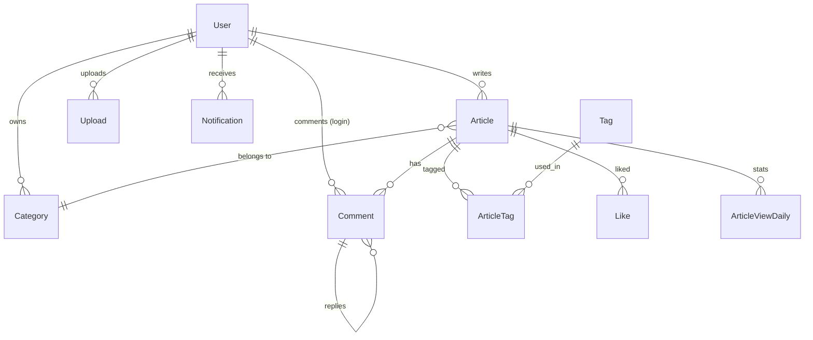

# 博客系统数据库架构设计文档

**文档版本：** v1.0  
**撰写日期：** 2026-06-27  
**撰写人：** 数据库架构师 · 高见远  
**文档状态：** 待评审  
**依赖文档：** PRD-博客系统-v1.0.md / Architecture-博客系统-v1.0.md  

---

## 目录

1. [ER 图](#一er-图)
2. [数据表定义](#二数据表定义)
3. [索引设计](#三索引设计)
4. [外键关系](#四外键关系)
5. [性能优化建议](#五性能优化建议)
6. [扩展字段建议](#六扩展字段建议)

---

## 一、ER 图

### 1.1 完整实体关系图

```mermaid
erDiagram
    User {
        int id PK
        string email UK
        string username UK
        string password_hash
        string blog_name
        string bio
        string avatar
        enum status
        timestamp created_at
        timestamp updated_at
        timestamp deleted_at
    }

    Role {
        int id PK
        string name UK
        string description
        timestamp created_at
    }

    Permission {
        int id PK
        string name UK
        string module
        string action
        timestamp created_at
    }

    UserRole {
        int id PK
        int user_id FK
        int role_id FK
        timestamp created_at
    }

    RolePermission {
        int id PK
        int role_id FK
        int permission_id FK
        timestamp created_at
    }

    SocialLink {
        int id PK
        int user_id FK
        string platform
        string url
        timestamp created_at
        timestamp updated_at
    }

    Article {
        int id PK
        int author_id FK
        string slug UK
        string title
        string content
        string summary
        string cover_image
        int category_id FK
        enum status
        enum content_type
        timestamp published_at
        int version
        timestamp created_at
        timestamp updated_at
        timestamp deleted_at
    }

    Category {
        int id PK
        int user_id FK
        string name
        string slug
        string description
        int sort_order
        timestamp created_at
        timestamp updated_at
        timestamp deleted_at
    }

    Tag {
        int id PK
        string name UK
        string slug UK
        int usage_count
        timestamp created_at
        timestamp updated_at
    }

    ArticleTag {
        int id PK
        int article_id FK
        int tag_id FK
        timestamp created_at
    }

    Comment {
        int id PK
        int article_id FK
        int author_id FK "nullable"
        int parent_id FK "nullable"
        string nickname "guest"
        string guest_email "guest"
        string content
        enum status
        string ip_address
        timestamp created_at
        timestamp updated_at
        timestamp deleted_at
    }

    Like {
        int id PK
        int article_id FK
        int user_id FK "nullable"
        string ip_address
        string fingerprint
        timestamp created_at
    }

    Upload {
        int id PK
        int user_id FK
        string original_name
        string storage_key
        string url
        string thumbnail_url
        string mime_type
        int file_size
        int width
        int height
        enum type
        timestamp created_at
        timestamp deleted_at
    }

    Notification {
        int id PK
        int user_id FK
        string type
        string title
        string content
        string link
        boolean is_read
        timestamp created_at
        timestamp updated_at
    }

    ArticleViewDaily {
        int id PK
        int article_id FK
        date view_date
        int view_count
        int unique_visitor_count
        timestamp created_at
        timestamp updated_at
    }

    RefreshToken {
        int id PK
        int user_id FK
        string token UK
        boolean is_revoked
        timestamp expires_at
        timestamp created_at
    }

    VerificationToken {
        int id PK
        int user_id FK
        string token UK
        enum type
        timestamp expires_at
        boolean is_used
        timestamp created_at
    }

    OperationLog {
        int id PK
        int user_id FK "nullable"
        string module
        string action
        string target_type
        int target_id
        string detail
        string ip_address
        timestamp created_at
    }

    User ||--o{ UserRole : "has roles"
    Role ||--o{ RolePermission : "has permissions"
    Role ||--o{ UserRole : "assigned to"
    Permission ||--o{ RolePermission : "granted to"
    User ||--o{ SocialLink : "has social links"
    User ||--o{ Article : "writes"
    User ||--o{ Upload : "uploads"
    User ||--o{ Notification : "receives"
    User ||--o{ RefreshToken : "holds"
    User ||--o{ VerificationToken : "receives"
    User ||--o{ OperationLog : "logs"
    User ||--o{ Comment : "comments (login)"
    User ||--o{ Like : "likes"
    User ||--o{ Category : "owns"
    Article ||--o{ ArticleTag : "tagged with"
    Article ||--o{ Comment : "has comments"
    Article ||--o{ Like : "liked by"
    Article ||--o| Category : "belongs to"
    Article ||--o{ ArticleViewDaily : "view stats"
    Tag ||--o{ ArticleTag : "used in"
    Comment ||--o{ Comment : "replies (parent)"
    Article ||--o{ Upload : "cover image"
```



### 1.2 核心业务实体关系简化图



---

## 二、数据表定义

### 2.1 users — 用户表

**用途**：存储所有用户的账号信息和核心资料，是系统最基础的实体。

| 字段 | 类型 | 长度 | 为空 | 默认值 | 说明 |
|------|------|------|:----:|--------|------|
| id | SERIAL | - | ❌ | 自增 | 主键，用户唯一标识 |
| email | VARCHAR | 255 | ❌ | - | 邮箱地址，用于登录和验证，唯一 |
| username | VARCHAR | 20 | ❌ | - | 用户名，注册后不可修改，唯一，仅允许字母数字下划线 |
| password_hash | VARCHAR | 255 | ❌ | - | bcrypt 加密后的密码（salt rounds=12），永不存储明文 |
| blog_name | VARCHAR | 50 | ✅ | NULL | 博客名称（5-50字），公开展示 |
| bio | VARCHAR | 200 | ✅ | NULL | 个人简介，公开展示 |
| avatar | VARCHAR | 500 | ✅ | NULL | 头像 URL，通过 Upload 模块获取 CDN 地址 |
| status | ENUM | - | ❌ | 'pending_verification' | 账号状态：pending_verification / active / suspended / deleted |
| last_login_at | TIMESTAMP | - | ✅ | NULL | 最近登录时间 |
| last_login_ip | VARCHAR | 45 | ✅ | NULL | 最近登录 IP（支持 IPv6） |
| created_at | TIMESTAMP | - | ❌ | NOW() | 注册时间 |
| updated_at | TIMESTAMP | - | ❌ | NOW() | 最后更新时间（Prisma 自动维护） |
| deleted_at | TIMESTAMP | - | ✅ | NULL | 软删除时间（有值=已删除） |

**ENUM status 取值说明**：

| 值 | 含义 | 触发条件 |
|----|------|---------|
| pending_verification | 注册未验证 | 注册后未点击验证链接 |
| active | 正常活跃 | 验证邮箱后 |
| suspended | 被冻结 | 管理员操作或严重违规 |
| deleted | 已删除 | 用户申请注销或管理员删除 |

---

### 2.2 roles — 角色表

**用途**：定义系统角色，用于 RBAC 权限控制。角色数量固定，不建议动态增减。

| 字段 | 类型 | 长度 | 为空 | 默认值 | 说明 |
|------|------|------|:----:|--------|------|
| id | SERIAL | - | ❌ | 自增 | 主键 |
| name | VARCHAR | 50 | ❌ | - | 角色名称，唯一：guest / user / author / admin / super_admin |
| description | VARCHAR | 200 | ✅ | NULL | 角色描述 |
| created_at | TIMESTAMP | - | ❌ | NOW() | 创建时间 |

**初始数据**：

| id | name | description |
|----|------|-------------|
| 1 | guest | 游客（未登录） |
| 2 | user | 普通用户（已登录无博客） |
| 3 | author | 作者（有博客的博主） |
| 4 | admin | 管理员 |
| 5 | super_admin | 超级管理员 |

---

### 2.3 permissions — 权限表

**用途**：定义细粒度权限项，按模块+动作组织。与角色通过 role_permissions 关联。

| 字段 | 类型 | 长度 | 为空 | 默认值 | 说明 |
|------|------|------|:----:|--------|------|
| id | SERIAL | - | ❌ | 自增 | 主键 |
| name | VARCHAR | 100 | ❌ | - | 权限名称，唯一，格式：`module:action`（如 `article:create`） |
| module | VARCHAR | 50 | ❌ | - | 所属模块（auth/user/article/comment/category/tag/upload/admin/analytics） |
| action | VARCHAR | 30 | ❌ | - | 动作类型（create/read/update/delete/publish/approve/manage） |
| description | VARCHAR | 200 | ✅ | NULL | 权限描述 |
| created_at | TIMESTAMP | - | ❌ | NOW() | 创建时间 |

---

### 2.4 user_roles — 用户-角色关联表

**用途**：用户与角色的多对多关联。一个用户可拥有多个角色（如既是 author 又是 admin）。

| 字段 | 类型 | 长度 | 为空 | 默认值 | 说明 |
|------|------|------|:----:|--------|------|
| id | SERIAL | - | ❌ | 自增 | 主键 |
| user_id | INTEGER | - | ❌ | - | 外键 → users.id |
| role_id | INTEGER | - | ❌ | - | 外键 → roles.id |
| created_at | TIMESTAMP | - | ❌ | NOW() | 角色分配时间 |

**约束**：`(user_id, role_id)` 组合唯一，防止重复分配。

---

### 2.5 role_permissions — 角色-权限关联表

**用途**：角色与权限的多对多关联，构成 RBAC 核心。

| 字段 | 类型 | 长度 | 为空 | 默认值 | 说明 |
|------|------|------|:----:|--------|------|
| id | SERIAL | - | ❌ | 自增 | 主键 |
| role_id | INTEGER | - | ❌ | - | 外键 → roles.id |
| permission_id | INTEGER | - | ❌ | - | 外键 → permissions.id |
| created_at | TIMESTAMP | - | ❌ | NOW() | 权限授予时间 |

**约束**：`(role_id, permission_id)` 组合唯一。

---

### 2.6 social_links — 社交链接表

**用途**：存储用户的社交平台链接（GitHub、Twitter 等），最多 5 个。从 User 表拆出以支持动态增减和灵活扩展。

| 字段 | 类型 | 长度 | 为空 | 默认值 | 说明 |
|------|------|------|:----:|--------|------|
| id | SERIAL | - | ❌ | 自增 | 主键 |
| user_id | INTEGER | - | ❌ | - | 外键 → users.id |
| platform | VARCHAR | 30 | ❌ | - | 平台标识：github / twitter / weibo / zhihu / linkedin / custom |
| url | VARCHAR | 500 | ❌ | - | 链接 URL |
| display_name | VARCHAR | 50 | ✅ | NULL | 自定义显示名称（platform=custom 时使用） |
| sort_order | INTEGER | - | ❌ | 0 | 排序序号（0-4，最多5个） |
| created_at | TIMESTAMP | - | ❌ | NOW() | 创建时间 |
| updated_at | TIMESTAMP | - | ❌ | NOW() | 更新时间 |

**约束**：同一 user_id 下 sort_order 不重复，同一 user_id 下 platform 不重复（custom 类型除外）。

---

### 2.7 articles — 文章表

**用途**：存储所有文章内容，是系统最核心的实体。草稿和已发布文章共用此表，通过 status 区分。

| 字段 | 类型 | 长度 | 为空 | 默认值 | 说明 |
|------|------|------|:----:|--------|------|
| id | SERIAL | - | ❌ | 自增 | 主键，管理端用 id 访问 |
| author_id | INTEGER | - | ❌ | - | 外键 → users.id，文章作者 |
| slug | VARCHAR | 200 | ✅ | NULL | URL Slug，读者端用 slug 访问；发布时自动从 title 生成，草稿态可自定义 |
| title | VARCHAR | 200 | ❌ | - | 文章标题 |
| content | TEXT | - | ❌ | - | Markdown 正文内容（无长度限制） |
| summary | VARCHAR | 300 | ✅ | NULL | 文章摘要/SEO description |
| cover_image | VARCHAR | 500 | ✅ | NULL | 封面图 URL |
| category_id | INTEGER | - | ✅ | NULL | 外键 → categories.id，草稿态可为空，发布时必填 |
| status | ENUM | - | ❌ | 'draft' | 文章状态：draft / published / archived |
| content_type | ENUM | - | ❌ | 'markdown' | 内容类型：markdown / rich_text（v1.2 扩展） |
| meta_title | VARCHAR | 200 | ✅ | NULL | 自定义 SEO Title（v1.2 扩展） |
| meta_description | VARCHAR | 300 | ✅ | NULL | 自定义 SEO Description（v1.2 扩展） |
| is_featured | BOOLEAN | - | ❌ | FALSE | 是否推荐文章（管理端设置） |
| allow_comment | BOOLEAN | - | ❌ | TRUE | 是否允许评论 |
| word_count | INTEGER | - | ✅ | NULL | 字数统计（自动计算） |
| version | INTEGER | - | ❌ | 1 | 版本号，每次发布递增（用于缓存失效和版本追踪） |
| published_at | TIMESTAMP | - | ✅ | NULL | 发布时间（首次 publish 时设置，unpublish 保留） |
| scheduled_at | TIMESTAMP | - | ✅ | NULL | 定时发布时间（v1.2 扩展） |
| created_at | TIMESTAMP | - | ❌ | NOW() | 创建时间 |
| updated_at | TIMESTAMP | - | ❌ | NOW() | 最后更新时间 |
| deleted_at | TIMESTAMP | - | ✅ | NULL | 软删除时间 |

**ENUM status 取值说明**：

| 值 | 含义 | 可转换 |
|----|------|--------|
| draft | 草稿 | → published |
| published | 已发布 | → draft（unpublish）/ archived |
| archived | 已归档 | → draft（恢复） |

**slug 生成规则**：
- 发布时若 slug 为空，自动从 title 生成（中文标题取拼音，英文标题取原文，限200字符）
- slug 全局唯一（已发布文章间不可重复，同一作者不同文章不可重复）
- 草稿态 slug 可为空或临时值

---

### 2.8 categories — 分类表

**用途**：文章的分类归属，每个博主有独立的分类体系（按用户隔离）。

| 字段 | 类型 | 长度 | 为空 | 默认值 | 说明 |
|------|------|------|:----:|--------|------|
| id | SERIAL | - | ❌ | 自增 | 主键 |
| user_id | INTEGER | - | ❌ | - | 外键 → users.id，分类所属博主 |
| name | VARCHAR | 50 | ❌ | - | 分类名称 |
| slug | VARCHAR | 60 | ✅ | NULL | URL Slug（自动从 name 生成） |
| description | VARCHAR | 200 | ✅ | NULL | 分类描述 |
| sort_order | INTEGER | - | ❌ | 0 | 排序序号 |
| parent_id | INTEGER | - | ✅ | NULL | 外键 → categories.id（自引用），支持二级分类（v1.2 扩展） |
| created_at | TIMESTAMP | - | ❌ | NOW() | 创建时间 |
| updated_at | TIMESTAMP | - | ❌ | NOW() | 更新时间 |
| deleted_at | TIMESTAMP | - | ✅ | NULL | 软删除时间 |

**约束**：同一 user_id 下 name 不重复。同一 user_id 下 slug 不重复。

---

### 2.9 tags — 标签表

**用途**：全局标签库，所有用户共享。标签是文章的轻量级分类补充，支持跨用户检索。

| 字段 | 类型 | 长度 | 为空 | 默认值 | 说明 |
|------|------|------|:----:|--------|------|
| id | SERIAL | - | ❌ | 自增 | 主键 |
| name | VARCHAR | 50 | ❌ | - | 标签名称，全局唯一 |
| slug | VARCHAR | 60 | ✅ | NULL | URL Slug，自动从 name 生成，全局唯一 |
| usage_count | INTEGER | - | ❌ | 0 | 使用次数（每次文章关联+1，取消关联-1） |
| created_at | TIMESTAMP | - | ❌ | NOW() | 创建时间 |
| updated_at | TIMESTAMP | - | ❌ | NOW() | 更新时间 |

**说明**：
- 标签全局共享而非用户隔离，因为标签天然具有跨作者聚合特性（如"分布式"标签下多个作者的文章）
- usage_count 通过触发器或应用层维护，不依赖实时 COUNT 查询
- 首次创建标签时（文章提交新标签名）自动创建记录

---

### 2.10 article_tags — 文章-标签关联表

**用途**：文章与标签的多对多关联，每篇文章最多5个标签。

| 字段 | 类型 | 长度 | 为空 | 默认值 | 说明 |
|------|------|------|:----:|--------|------|
| id | SERIAL | - | ❌ | 自增 | 主键 |
| article_id | INTEGER | - | ❌ | - | 外键 → articles.id |
| tag_id | INTEGER | - | ❌ | - | 外键 → tags.id |
| created_at | TIMESTAMP | - | ❌ | NOW() | 关联时间 |

**约束**：`(article_id, tag_id)` 组合唯一。同一 article_id 最多 5 条记录。

---

### 2.11 comments — 评论表

**用途**：存储文章评论，支持登录用户评论和游客评论（nickname + email），支持 @回复（树状结构）。

| 字段 | 类型 | 长度 | 为空 | 默认值 | 说明 |
|------|------|------|:----:|--------|------|
| id | SERIAL | - | ❌ | 自增 | 主键 |
| article_id | INTEGER | - | ❌ | - | 外键 → articles.id |
| author_id | INTEGER | - | ✅ | NULL | 外键 → users.id（登录用户评论有值） |
| parent_id | INTEGER | - | ✅ | NULL | 外键 → comments.id（自引用，回复评论有值） |
| nickname | VARCHAR | 50 | ✅ | NULL | 游客昵称（author_id 为空时必填） |
| guest_email | VARCHAR | 255 | ✅ | NULL | 游客邮箱（author_id 为空时必填，不公开显示） |
| content | TEXT | - | ❌ | - | 评论正文（Markdown 格式，限制≤1000字） |
| status | ENUM | - | ❌ | 'pending' | 评论状态：pending / approved / rejected / spam |
| ip_address | VARCHAR | 45 | ✅ | NULL | 评论者 IP（用于反刷和审计） |
| user_agent | VARCHAR | 500 | ✅ | NULL | 浏览器 UA（用于反刷识别） |
| created_at | TIMESTAMP | - | ❌ | NOW() | 评论时间 |
| updated_at | TIMESTAMP | - | ❌ | NOW() | 更新时间 |
| deleted_at | TIMESTAMP | - | ✅ | NULL | 软删除时间 |

**ENUM status 取值说明**：

| 值 | 含义 | 触发条件 |
|----|------|---------|
| pending | 待审核 | 新创建评论（博主可配置默认 approved） |
| approved | 已通过 | 博主审核通过或博主配置自动通过 |
| rejected | 已拒绝 | 博主拒绝 |
| spam | 垃圾评论 | 反垃圾系统判定 |

**说明**：
- `author_id` 和 `(nickname, guest_email)` 二选一：登录用户用 author_id，游客用 nickname+guest_email
- `parent_id` 为空表示顶层评论，有值表示对某条评论的回复（支持多级嵌套，建议最多3级）

---

### 2.12 likes — 点赞表

**用途**：存储文章点赞记录（v1.1 功能），防重复点赞（同一用户/IP+指纹只允许一次）。

| 字段 | 类型 | 长度 | 为空 | 默认值 | 说明 |
|------|------|------|:----:|--------|------|
| id | SERIAL | - | ❌ | 自增 | 主键 |
| article_id | INTEGER | - | ❌ | - | 外键 → articles.id |
| user_id | INTEGER | - | ✅ | NULL | 外键 → users.id（登录用户有值） |
| ip_address | VARCHAR | 45 | ✅ | NULL | 点赞者 IP（游客点赞防重复） |
| fingerprint | VARCHAR | 100 | ✅ | NULL | 浏览器指纹（游客防刷辅助） |
| created_at | TIMESTAMP | - | ❌ | NOW() | 点赞时间 |

**约束**：
- 登录用户：同一 `(article_id, user_id)` 组合唯一
- 游客：同一 `(article_id, ip_address, fingerprint)` 组合唯一
- 应用层保证：`user_id` 有值时忽略 ip/fingerprint 去重，`user_id` 为空时用 ip+fingerprint 去重

---

### 2.13 uploads — 上传文件表

**用途**：记录所有上传到 OSS 的文件信息，构成用户的媒体库。

| 字段 | 类型 | 长度 | 为空 | 默认值 | 说明 |
|------|------|------|:----:|--------|------|
| id | SERIAL | - | ❌ | 自增 | 主键 |
| user_id | INTEGER | - | ❌ | - | 外键 → users.id，上传者 |
| original_name | VARCHAR | 255 | ❌ | - | 原始文件名（仅记录，实际存储用安全名） |
| storage_key | VARCHAR | 500 | ❌ | - | OSS 存储 Key（如 `uploads/1/2026/06/abc123.jpg`） |
| url | VARCHAR | 500 | ❌ | - | CDN 访问 URL |
| thumbnail_url | VARCHAR | 500 | ✅ | NULL | 缩略图 URL（OSS 图片处理后生成） |
| mime_type | VARCHAR | 100 | ❌ | - | MIME 类型：image/jpeg / image/png / image/gif / image/webp |
| file_size | INTEGER | - | ❌ | - | 文件大小（字节） |
| width | INTEGER | - | ✅ | NULL | 图片宽度（px，仅图片类型） |
| height | INTEGER | - | ✅ | NULL | 图片高度（px，仅图片类型） |
| type | ENUM | - | ❌ | 'image' | 文件类型：image / document / video（未来扩展） |
| created_at | TIMESTAMP | - | ❌ | NOW() | 上传时间 |
| deleted_at | TIMESTAMP | - | ✅ | NULL | 软删除时间（删除时 OSS 文件异步清理） |

---

### 2.14 notifications — 通知表

**用途**：站内通知（评论通知、系统通知），邮件通知不存此表（由 MQ + SMTP 处理）。

| 字段 | 类型 | 长度 | 为空 | 默认值 | 说明 |
|------|------|------|:----:|--------|------|
| id | SERIAL | - | ❌ | 自增 | 主键 |
| user_id | INTEGER | - | ❌ | - | 外键 → users.id，通知接收者 |
| type | ENUM | - | ❌ | - | 通知类型：comment / system / like / follow（未来扩展） |
| title | VARCHAR | 200 | ❌ | - | 通知标题 |
| content | TEXT | - | ✅ | NULL | 通知内容（可选） |
| link | VARCHAR | 500 | ✅ | NULL | 关联链接（如文章详情页 URL） |
| sender_id | INTEGER | - | ✅ | NULL | 外键 → users.id，触发者（如评论者） |
| is_read | BOOLEAN | - | ❌ | FALSE | 是否已读 |
| created_at | TIMESTAMP | - | ❌ | NOW() | 通知时间 |
| updated_at | TIMESTAMP | - | ❌ | NOW() | 标记已读时间 |

---

### 2.15 article_view_daily — 每日阅读统计表

**用途**：每日归档的阅读量数据，从 Redis INCR 定时写入 PG。用于趋势图表和历史统计。

| 字段 | 类型 | 长度 | 为空 | 默认值 | 说明 |
|------|------|------|:----:|--------|------|
| id | SERIAL | - | ❌ | 自增 | 主键 |
| article_id | INTEGER | - | ❌ | - | 外键 → articles.id |
| view_date | DATE | - | ❌ | - | 统计日期 |
| view_count | INTEGER | - | ❌ | 0 | 当日总阅读量 |
| unique_visitor_count | INTEGER | - | ❌ | 0 | 当日独立访客数（IP+UA 去重） |
| created_at | TIMESTAMP | - | ❌ | NOW() | 记录创建时间 |
| updated_at | TIMESTAMP | - | ❌ | NOW() | 记录更新时间 |

**约束**：`(article_id, view_date)` 组合唯一。每日归档时 INSERT 或 UPDATE（同一天同一文章只有一条记录）。

---

### 2.16 refresh_tokens — Refresh Token 表

**用途**：存储 JWT Refresh Token，用于 Access Token 刷新。支持 Token 主动撤销（登出/修改密码时 revoke 所有 Token）。

| 字段 | 类型 | 长度 | 为空 | 默认值 | 说明 |
|------|------|------|:----:|--------|------|
| id | SERIAL | - | ❌ | 自增 | 主键 |
| user_id | INTEGER | - | ❌ | - | 外键 → users.id |
| token | VARCHAR | 500 | ❌ | - | Refresh Token 值（加密存储），唯一 |
| is_revoked | BOOLEAN | - | ❌ | FALSE | 是否已撤销 |
| expires_at | TIMESTAMP | - | ❌ | - | Token 过期时间 |
| device_info | VARCHAR | 200 | ✅ | NULL | 设备信息（用于多设备管理，v1.2 扩展） |
| created_at | TIMESTAMP | - | ❌ | NOW() | Token 创建时间 |

**说明**：登出时 revoke 当前 Token；修改密码时 revoke 所有该用户的 Token；定期清理过期 Token。

---

### 2.17 verification_tokens — 验证 Token 表

**用途**：存储邮箱验证和密码重置的临时 Token，验证后标记 is_used=true。

| 字段 | 类型 | 长度 | 为空 | 默认值 | 说明 |
|------|------|------|:----:|--------|------|
| id | SERIAL | - | ❌ | 自增 | 主键 |
| user_id | INTEGER | - | ❌ | - | 外键 → users.id |
| token | VARCHAR | 100 | ❌ | - | 验证 Token（随机生成），唯一 |
| type | ENUM | - | ❌ | - | Token 类型：email_verification / password_reset |
| expires_at | TIMESTAMP | - | ❌ | - | 过期时间（邮箱验证24h，密码重置1h） |
| is_used | BOOLEAN | - | ❌ | FALSE | 是否已使用 |
| created_at | TIMESTAMP | - | ❌ | NOW() | Token 创建时间 |

---

### 2.18 operation_logs — 操作日志表

**用途**：记录关键操作（登录、发布、删除、审核、权限变更等），用于安全审计和行为追踪。仅超级管理员可查看。

| 字段 | 类型 | 长度 | 为空 | 默认值 | 说明 |
|------|------|------|:----:|--------|------|
| id | BIGSERIAL | - | ❌ | 自增 | 主键（用 BIGINT，日志量大） |
| user_id | INTEGER | - | ✅ | NULL | 外键 → users.id（操作者，游客操作为 NULL） |
| module | VARCHAR | 50 | ❌ | - | 操作模块：auth / user / article / comment / admin / system |
| action | VARCHAR | 50 | ❌ | - | 操作动作：login / create / update / delete / publish / approve / suspend |
| target_type | VARCHAR | 50 | ✅ | NULL | 操作对象类型：user / article / comment / category / tag |
| target_id | INTEGER | - | ✅ | NULL | 操作对象 ID |
| detail | TEXT | - | ✅ | NULL | 操作详情（JSON 格式，如修改了哪些字段） |
| ip_address | VARCHAR | 45 | ✅ | NULL | 操作者 IP |
| user_agent | VARCHAR | 500 | ✅ | NULL | 浏览器 UA |
| created_at | TIMESTAMP | - | ❌ | NOW() | 操作时间 |

**说明**：此表只做 INSERT，不做 UPDATE/DELETE。定期归档（超过90天的数据迁移到归档表或冷存储）。

---

## 三、索引设计

### 3.1 主键索引（自动创建）

PostgreSQL 的 SERIAL/BIGSERIAL 主键自动创建唯一 B-Tree 索引，无需手动添加。

| 表 | 主键 | 索引类型 |
|----|------|---------|
| users | id | B-Tree (自动) |
| roles | id | B-Tree (自动) |
| permissions | id | B-Tree (自动) |
| user_roles | id | B-Tree (自动) |
| role_permissions | id | B-Tree (自动) |
| social_links | id | B-Tree (自动) |
| articles | id | B-Tree (自动) |
| categories | id | B-Tree (自动) |
| tags | id | B-Tree (自动) |
| article_tags | id | B-Tree (自动) |
| comments | id | B-Tree (自动) |
| likes | id | B-Tree (自动) |
| uploads | id | B-Tree (自动) |
| notifications | id | B-Tree (自动) |
| article_view_daily | id | B-Tree (自动) |
| refresh_tokens | id | B-Tree (自动) |
| verification_tokens | id | B-Tree (自动) |
| operation_logs | id | B-Tree (自动) |

---

### 3.2 唯一索引

| 表 | 字段 | 索引名 | 理由 |
|----|------|--------|------|
| users | email | `uk_users_email` | 邮箱登录唯一性保证，最频繁的登录查询 |
| users | username | `uk_users_username` | 用户名唯一性，公开主页路由依赖此字段 |
| articles | slug | `uk_articles_slug` | Slug 全局唯一，读者端 URL 路由依赖 |
| tags | name | `uk_tags_name` | 标签名全局唯一，创建时检查 |
| tags | slug | `uk_tags_slug` | 标签 Slug 全局唯一，URL 路由 |
| categories | (user_id, name) | `uk_categories_user_name` | 同一用户分类名不重复 |
| categories | (user_id, slug) | `uk_categories_user_slug` | 同一用户分类 Slug 不重复 |
| article_tags | (article_id, tag_id) | `uk_article_tags_pair` | 防止重复关联 |
| user_roles | (user_id, role_id) | `uk_user_roles_pair` | 防止重复角色分配 |
| role_permissions | (role_id, permission_id) | `uk_role_permissions_pair` | 防止重复权限授予 |
| refresh_tokens | token | `uk_refresh_tokens_token` | Token 唯一性，刷新时查找 |
| verification_tokens | token | `uk_verification_tokens_token` | Token 唯一性，验证时查找 |
| article_view_daily | (article_id, view_date) | `uk_view_daily_article_date` | 同日同文章唯一记录 |
| likes | (article_id, user_id) | `uk_likes_article_user` | 登录用户防重复点赞 |

---

### 3.3 性能索引（B-Tree）

| 表 | 字段 | 紎引名 | 理由 |
|----|------|--------|------|
| users | status | `idx_users_status` | 管理后台按状态筛选用户 |
| articles | author_id | `idx_articles_author_id` | "我的文章"列表查询，高频操作 |
| articles | status | `idx_articles_status` | 按状态筛选（draft/published），管理端核心查询 |
| articles | category_id | `idx_articles_category_id` | 按分类筛选文章列表 |
| articles | published_at | `idx_articles_published_at` | 读者端按时间排序（最新发布），最频繁的读者查询 |
| articles | (status, published_at) | `idx_articles_status_published_at` | **复合索引**：覆盖 "已发布+按时间排序" 的最高频查询 |
| articles | (author_id, status) | `idx_articles_author_status` | **复合索引**：覆盖 "某作者的文章+按状态筛选" |
| categories | user_id | `idx_categories_user_id` | 查询某用户的分类列表 |
| comments | article_id | `idx_comments_article_id` | 查询某文章的评论列表 |
| comments | (article_id, status) | `idx_comments_article_status` | **复合索引**：某文章的已通过评论（读者端高频） |
| comments | parent_id | `idx_comments_parent_id` | 查询回复列表（树状结构） |
| comments | author_id | `idx_comments_author_id` | 查询某用户的评论 |
| likes | article_id | `idx_likes_article_id` | 查询某文章的点赞数 |
| article_tags | article_id | `idx_article_tags_article_id` | 查询某文章的标签列表 |
| article_tags | tag_id | `idx_article_tags_tag_id` | 查询某标签下的文章列表 |
| uploads | user_id | `idx_uploads_user_id` | 查询某用户的媒体库 |
| uploads | (user_id, created_at) | `idx_uploads_user_created` | **复合索引**：用户媒体库按时间排序 |
| notifications | (user_id, is_read) | `idx_notifications_user_read` | 查询未读通知数，高频操作 |
| notifications | user_id | `idx_notifications_user_id` | 查询用户通知列表 |
| article_view_daily | (article_id, view_date) | `idx_view_daily_article_date_desc` | 查询某文章的阅读趋势（按日期范围） |
| article_view_daily | view_date | `idx_view_daily_date` | 查询某日全站阅读量 |
| operation_logs | user_id | `idx_op_logs_user_id` | 查询某用户的操作历史 |
| operation_logs | (module, action) | `idx_op_logs_module_action` | 查询特定模块的操作日志 |
| operation_logs | created_at | `idx_op_logs_created_at` | 查询时间范围内的日志 |
| verification_tokens | (user_id, type, is_used) | `idx_verify_tokens_user_type` | 查找某用户特定类型的未使用 Token |
| refresh_tokens | (user_id, is_revoked) | `idx_refresh_tokens_user_revoked` | 查找某用户的有效 Refresh Token |

---

### 3.4 全文检索索引（GIN / tsvector）

| 表 | 字段 | 索引名 | 理由 |
|----|------|--------|------|
| articles | title_search | `idx_articles_title_search` (GIN) | **MVP 期全文搜索**：标题 tsvector 索引，支持中文分词（pg_jieba 或 zhparser） |
| articles | content_search | `idx_articles_content_search` (GIN) | **MVP 期全文搜索**：正文 tsvector 索引 |
| articles | (title, content) combined | `idx_articles_combined_search` (GIN) | **复合搜索向量**：标题+正文联合搜索（优先级标题权重A，正文权重B） |

**tsvector 列定义（应用层或触发器维护）**：

```sql
-- 说明（非 ORM 代码，仅展示 tsvector 列定义方式）
-- title_search: to_tsvector('jieba', title)
-- content_search: to_tsvector('jieba', content)
-- combined_search: setweight(to_tsvector('jieba', title), 'A') || setweight(to_tsvector('jieba', content), 'B')
```

**说明**：
- MVP 期使用 PostgreSQL 内置 tsvector + GIN 索引替代 Elasticsearch
- v1.1 正式引入 ES 后，这些索引可作为 fallback 或逐步废弃
- 中文分词需安装 `pg_jieba` 或 `zhparser` 扩展

---

### 3.5 索引设计原则总结

| 原则 | 说明 |
|------|------|
| **高频查询优先** | 读者端查询（文章列表/详情/评论）索引优先级最高 |
| **复合索引覆盖** | 将 WHERE + ORDER BY 常用组合建立复合索引，避免额外排序 |
| **避免过度索引** | 每张表索引不超过 5-6 个（写入性能与查询性能平衡） |
| **GIN 仅用于全文搜索** | tsvector GIN 索引体积大，只在需要全文搜索的列使用 |
| **冷表少索引** | operation_logs 等日志表只建时间+模块索引，不建过多 |

---

## 四、外键关系

### 4.1 外键详细清单

| 子表 | 外键字段 | 父表 | 父字段 | ON DELETE | ON UPDATE | 说明 |
|------|---------|------|--------|-----------|-----------|------|
| user_roles | user_id | users | id | CASCADE | NO ACTION | 用户删除时级联删除角色关联 |
| user_roles | role_id | roles | id | RESTRICT | NO ACTION | 角色不可删除（固定角色），有引用时拒绝删除 |
| role_permissions | role_id | roles | id | CASCADE | NO ACTION | 角色删除时级联删除权限关联 |
| role_permissions | permission_id | permissions | id | CASCADE | NO ACTION | 权限删除时级联删除 |
| social_links | user_id | users | id | CASCADE | NO ACTION | 用户删除时级联删除社交链接 |
| articles | author_id | users | id | RESTRICT | NO ACTION | 有文章的用户不可直接删除（需先处理文章） |
| articles | category_id | categories | id | SET NULL | NO ACTION | 分类删除时文章 category_id 设为 NULL（草稿态允许） |
| categories | user_id | users | id | CASCADE | NO ACTION | 用户删除时级联删除分类 |
| categories | parent_id | categories | id | SET NULL | NO ACTION | 父分类删除时子分类 parent_id 设为 NULL |
| article_tags | article_id | articles | id | CASCADE | NO ACTION | 文章删除时级联删除标签关联 |
| article_tags | tag_id | tags | id | RESTRICT | NO ACTION | 有引用的标签不可直接删除 |
| comments | article_id | articles | id | CASCADE | NO ACTION | 文章删除时级联删除评论 |
| comments | author_id | users | id | SET NULL | NO ACTION | 用户删除时评论 author_id 设为 NULL（评论保留，显示"已注销用户"） |
| comments | parent_id | comments | id | CASCADE | NO ACTION | 父评论删除时级联删除所有回复 |
| likes | article_id | articles | id | CASCADE | NO ACTION | 文章删除时级联删除点赞 |
| likes | user_id | users | id | CASCADE | NO ACTION | 用户删除时级联删除点赞记录 |
| uploads | user_id | users | id | CASCADE | NO ACTION | 用户删除时级联删除上传记录 |
| notifications | user_id | users | id | CASCADE | NO ACTION | 用户删除时级联删除通知 |
| notifications | sender_id | users | id | SET NULL | NO ACTION | 发送者删除时 sender_id 设为 NULL |
| article_view_daily | article_id | articles | id | CASCADE | NO ACTION | 文章删除时级联删除统计数据 |
| refresh_tokens | user_id | users | id | CASCADE | NO ACTION | 用户删除时级联删除所有 Token |
| verification_tokens | user_id | users | id | CASCADE | NO ACTION | 用户删除时级联删除验证 Token |
| operation_logs | user_id | users | id | SET NULL | NO ACTION | 用户删除时日志 user_id 设为 NULL（日志保留） |

---

### 4.2 ON DELETE 策略说明

| 策略 | 适用场景 | 示例 |
|------|---------|------|
| **CASCADE** | 子记录随父记录一起删除 | 用户删除 → 社交链接/通知/Token 全部删除 |
| **SET NULL** | 子记录保留但引用设为空 | 用户删除 → 评论保留但 author_id=NULL，显示"已注销"；分类删除 → 文章 category_id=NULL |
| **RESTRICT** | 有子记录时拒绝删除父记录 | 有文章的用户不可直接删除（需先软删除或迁移文章）；有引用的标签不可删除 |

---

### 4.3 外键关系图（Mermaid）

```mermaid
graph TB
    users["users (核心)"]
    
    users -->|"CASCADE"| user_roles
    users -->|"CASCADE"| social_links
    users -->|"CASCADE"| categories
    users -->|"CASCADE"| uploads
    users -->|"CASCADE"| notifications
    users -->|"CASCADE"| refresh_tokens
    users -->|"CASCADE"| verification_tokens
    users -->|"SET NULL"| comments["comments.author_id"]
    users -->|"SET NULL"| operation_logs["operation_logs.user_id"]
    users -->|"SET NULL"| notifications_sender["notifications.sender_id"]
    users -->|"RESTRICT"| articles["articles.author_id"]
    users -->|"CASCADE"| likes
    
    articles -->|"CASCADE"| article_tags
    articles -->|"CASCADE"| comments_article["comments.article_id"]
    articles -->|"CASCADE"| likes_article["likes.article_id"]
    articles -->|"SET NULL"| category_ref["articles.category_id"]
    articles -->|"CASCADE"| article_view_daily
    
    categories -->|"SET NULL"| category_parent["categories.parent_id"]
    tags -->|"RESTRICT"| article_tags
    
    comments -->|"CASCADE"| comment_replies["comments.parent_id"]
    
    roles -->|"RESTRICT"| user_roles
    roles -->|"CASCADE"| role_permissions
    
    permissions -->|"CASCADE"| role_permissions
```



---

## 五、性能优化建议

### 5.1 缓存策略

| 数据 | 缓存位置 | 缓存 Key | TTL | 更新策略 | 理由 |
|------|---------|---------|-----|---------|------|
| 热点文章详情 | Redis | `article:{id}` | 5 分钟 | 发布/更新时主动失效 | 读者端最高频查询，PG 查询成本高（含 content 大字段） |
| 文章列表（读者端） | Redis | `articles:{username}:page:{n}` | 10 分钟 | 发布/删除时清除该用户所有列表缓存 | 首页列表高频访问 |
| 用户公开主页 | Redis | `user:profile:{username}` | 30 分钟 | 修改资料时主动失效 | 读者端每次访问文章都附带博主信息 |
| 分类列表 | Redis | `categories:{user_id}` | 30 分钟 | 增删改分类时失效 | 数据量小（每用户通常≤10个），但编辑器频繁读取 |
| 标签列表 | Redis | `tags:popular` | 1 小时 | 定时刷新 | 全局热门标签，数据稳定 |
| 阅读量计数 | Redis | `views:article:{id}` | 24 小时 | 每日归档后清零 | Redis INCR 天然适配计数器，避免每次阅读都写 PG |
| 未读通知数 | Redis | `notif:unread:{user_id}` | 无 TTL | 每次创建/阅读通知时更新 | 避免每次打开页面都 COUNT 查询 |
| Rate Limit 计数 | Redis | `ratelimit:{ip}:{endpoint}` | 窗口期 | 自动过期 | 限流必需，PG 不适合 |

---

### 5.2 避免 JOIN 的场景

| 场景 | 替代方案 | 理由 |
|------|---------|------|
| **文章列表 + 作者信息** | 文章列表从 Redis 缓存读取，作者信息单独缓存，前端组装 | 避免 `articles JOIN users`（文章列表是大查询，JOIN 增加开销） |
| **文章列表 + 分类名** | 文章表存 `category_name` 冗余字段（或缓存中附带） | 分类名极少变化，冗余存储避免每次列表都 JOIN categories |
| **文章列表 + 标签** | 标签列表单独查询（article_tags + tags），不在文章列表主查询中 JOIN | 一篇文章5个标签，LEFT JOIN 导致结果行膨胀，改用子查询或二次查询 |
| **文章列表 + 评论数** | 评论数从 Redis 缓存读取（`comment:count:{article_id}`），或 articles 表冗余 `comment_count` 字段 | 避免 `articles LEFT JOIN (SELECT COUNT...) comments`，每篇文章都子查询成本高 |
| **文章列表 + 点赞数** | 同评论数策略，冗余 `like_count` 字段或缓存 | 同理 |
| **文章列表 + 阅读量** | 阅读量从 Redis 读取（`views:article:{id}`），不在 PG 中 JOIN | Redis INCR 实时计数，PG 归档数据只用于历史趋势 |
| **用户资料 + 角色** | 用户角色在登录时加载并缓存到 JWT payload 或 Redis | 鉴权高频，避免每次请求都 `user_roles JOIN roles` |
| **通知列表 + 发送者昵称** | 通知创建时冗余 `sender_nickname` 和 `sender_avatar` | 发送者信息不变，冗余避免 JOIN users |

---

### 5.3 冗余字段设计（反范式优化）

| 表 | 冗余字段 | 来源 | 更新时机 | 理由 |
|----|---------|------|---------|------|
| articles | comment_count | COUNT(comments) | 评论创建/删除时 ±1 | 列表展示评论数，避免 JOIN COUNT |
| articles | like_count | COUNT(likes) | 点赞/取消时 ±1 | 列表展示点赞数 |
| articles | category_name | categories.name | 分类名变更时同步 | 列表展示分类名，避免 JOIN |
| articles | author_name | users.username / users.blog_name | 用户修改资料时同步 | 读者端展示博主名 |
| articles | author_avatar | users.avatar | 用户修改头像时同步 | 读者端展示博主头像 |
| tags | usage_count | COUNT(article_tags) | 文章关联/取消标签时 ±1 | 标签列表展示使用次数，避免 COUNT |

**冗余字段更新方式**：
- 应用层维护（Service 层在增删改时同步更新冗余字段）
- 不使用数据库触发器（触发器隐式逻辑，调试困难）

---

### 5.4 分页优化

| 场景 | 分页方式 | 理由 |
|------|---------|------|
| **文章列表（读者端）** | Keyset 分页（WHERE published_at < last_seen_date ORDER BY published_at DESC LIMIT N） | 传统 OFFSET 分页在大数据量下性能差（OFFSET 100000 需扫描100000行）；Keyset 利用索引直接定位 |
| **文章列表（管理端）** | OFFSET 分页（LIMIT + OFFSET） | 管理端需支持跳页（第1页→第5页），Keyset 不支持跳页；管理端数据量通常不大 |
| **评论列表** | Keyset 分页（WHERE created_at < last_seen_created_at） | 评论区无限滚动加载，天然适合 Keyset |
| **媒体库列表** | OFFSET 分页 | 数据量中等，管理端网格展示需要跳页 |
| **操作日志** | Keyset + 时间范围筛选（WHERE created_at BETWEEN ... ORDER BY created_at DESC） | 日志量大，只看最近数据；时间范围索引高效 |
| **通知列表** | Keyset 分页（WHERE created_at < last_created_at） | 通知无限滚动 |

**Keyset 分页说明**：
- 读者端文章列表：`WHERE status='published' AND published_at < '上次最后一条的published_at' ORDER BY published_at DESC LIMIT 10`
- 利用 `idx_articles_status_published_at` 复合索引，查询极快
- 前端传 `cursor=published_at值` 而非 `page=数字`

---

### 5.5 大字段优化

| 表 | 大字段 | 优化方式 |
|----|--------|---------|
| articles | content (TEXT) | 列表查询排除 content（SELECT id, title, slug, summary, ... 不含 content），只在详情页查询 content |
| comments | content (TEXT) | 同理，列表不含 content（但实际上评论短，可包含） |
| operation_logs | detail (TEXT/JSON) | 归档后迁移到冷存储，热表只保留最近90天 |

**articles 表查询策略**：

| 场景 | SELECT 字段 | 说明 |
|------|-------------|------|
| 文章列表（管理端） | id, slug, title, status, category_id, category_name, cover_image, comment_count, like_count, created_at, updated_at, published_at | **不含 content**，列表页只看摘要 |
| 文章列表（读者端） | id, slug, title, summary, cover_image, author_name, author_avatar, category_name, comment_count, like_count, published_at | **不含 content**，读者首页/归档页 |
| 文章详情（管理端） | 全字段 | 编辑页需要完整内容 |
| 文章详情（读者端） | id, slug, title, content, summary, cover_image, author_id, author_name, author_avatar, category_id, category_name, comment_count, like_count, published_at, allow_comment, word_count | 含 content，但利用 Redis 缓存 |

---

### 5.6 批量操作优化

| 操作 | 优化方式 |
|------|---------|
| **文章标签批量关联** | 单条 INSERT ... ON CONFLICT DO NOTHING（不重复关联），不用逐条插入 |
| **每日阅读量归档** | INSERT ... ON CONFLICT (article_id, view_date) DO UPDATE SET view_count = view_count + excluded.view_count |
| **软删除用户级联清理** | 应用层按顺序清理：先 soft-delete 用户 → soft-delete 文章 → cascade 清理评论/点赞/通知（不依赖 DB CASCADE，避免大事务锁表） |
| **评论审核批量通过** | UPDATE comments SET status='approved' WHERE id IN (...) AND article_id IN (作者的文章)，单条批量 UPDATE |

---

## 六、扩展字段建议

### 6.1 通用扩展字段

每张核心业务表建议包含以下标准字段，应用层统一处理：

| 字段 | 类型 | 适用表 | 说明 |
|------|------|--------|------|
| **created_at** | TIMESTAMP NOT NULL DEFAULT NOW() | 所有表 | 记录创建时间，Prisma @updatedAt 自动维护 |
| **updated_at** | TIMESTAMP NOT NULL DEFAULT NOW() | 所有可编辑表 | 记录更新时间，Prisma @updatedAt 自动维护 |
| **deleted_at** | TIMESTAMP NULL | users, articles, categories, comments, uploads | 软删除时间戳。有值=已删除，查询时 WHERE deleted_at IS NULL 过滤 |
| **version** | INTEGER NOT NULL DEFAULT 1 | articles | 乐观锁版本号，每次发布+1，防止并发冲突 |
| **status** | ENUM | users, articles, comments, notifications | 状态字段，统一用 ENUM 类型，状态机明确 |

---

### 6.2 软删除策略

| 表 | 是否软删除 | 理由 |
|----|-----------|------|
| users | ✅ | 用户注销后保留记录30天（合规要求），30天后硬删除 |
| articles | ✅ | 作者可能误删，保留恢复窗口；SEO 已收录的 URL 需保留重定向 |
| categories | ✅ | 可能误删，保留恢复窗口 |
| comments | ✅ | 可能误删，审核需要 |
| uploads | ✅ | OSS 文件异步清理，先标记再延迟删除 |
| tags | ❌ | 标签全局共享，硬删除（有引用时 RESTRICT 拒绝） |
| article_tags | ❌ | 关联记录直接硬删除 |
| likes | ❌ | 点赞记录直接硬删除 |
| notifications | ❌ | 通知直接硬删除或归档 |
| operation_logs | ❌ | 只 INSERT，永不 UPDATE/DELETE |

---

### 6.3 预留扩展字段（为未来版本准备）

| 表 | 预留字段 | 类型 | 默认值 | 版本 | 说明 |
|----|---------|------|--------|------|------|
| users | locale | VARCHAR(10) | 'zh-CN' | v1.2 | 用户语言偏好（国际化） |
| users | theme | VARCHAR(30) | 'default' | v1.2 | 博客主题选择 |
| users | custom_domain | VARCHAR(200) | NULL | v1.2 | 自定义域名 |
| users | comment_policy | ENUM | 'require_approval' | v1.1 | 评论策略：require_approval / auto_approve / disabled |
| articles | content_type | ENUM | 'markdown' | v1.0 | 已定义，v1.2 增加 'rich_text' |
| articles | meta_title | VARCHAR(200) | NULL | v1.2 | 自定义 SEO Title |
| articles | meta_description | VARCHAR(300) | NULL | v1.2 | 自定义 SEO Description |
| articles | scheduled_at | TIMESTAMP | NULL | v1.2 | 定时发布时间 |
| articles | is_premium | BOOLEAN | FALSE | v2.0 | 是否付费文章 |
| articles | price | DECIMAL(10,2) | NULL | v2.0 | 付费价格 |
| categories | parent_id | INTEGER | NULL | v1.2 | 已定义，支持二级分类 |
| comments | like_count | INTEGER | 0 | v1.1 | 评论点赞数（冗余） |
| notifications | type | ENUM | - | v1.0 | 已定义，v1.1 增加 'like'，v2.0 增加 'follow' |
| uploads | type | ENUM | 'image' | v1.0 | 已定义，v2.0 增加 'video' / 'document' |

---

### 6.4 JSONB 扩展字段（灵活存储）

| 表 | JSONB 字段 | 用途 | 典型内容 |
|----|-----------|------|---------|
| users | metadata | 灵活扩展用户属性 | `{"newsletter_subscribed": true, "github_id": "xxx", "preferred_editor": "markdown"}` |
| articles | metadata | 文章扩展元数据 | `{"schema_org_type": "TechArticle", "reading_time_minutes": 5, "toc": ["概述", "设计", "实现"]}` |
| operation_logs | detail | 操作详情（替代 TEXT） | `{"old_status": "draft", "new_status": "published", "changed_fields": ["status", "published_at"]}` |

**JSONB 优势**：
- 不需要 ALTER TABLE 就能添加新属性
- PostgreSQL JSONB 支持 GIN 索引查询
- 适合不确定的、低频查询的扩展数据

---

### 6.5 时区与编码建议

| 维度 | 建议 |
|------|------|
| **时区** | 所有 TIMESTAMP 字段使用 UTC 存储（无时区偏移），应用层按用户 locale 转换显示 |
| **编码** | PostgreSQL 使用 UTF-8 编码（CREATE DATABASE ... ENCODING 'UTF8'） |
| **排序规则** | 使用 `zh_CN` 排序规则支持中文排序（COLLATE "zh_CN"） |
| **ID 策略** | 内部 ID 使用 SERIAL/BIGSERIAL（自增整数），公开 URL 使用 slug（不暴露内部 ID） |
| **UUID** | 不使用 UUID 作为主键（插入性能差、索引体积大），仅在需要全局唯一且不可预测的场景使用（如 verification_token） |

---

## 附录 A：数据量预估与存储规划

| 表 | MVP 期预估行数 | 年增长预估 | 存储预估（单行） | 说明 |
|----|-------------|-----------|---------------|------|
| users | 1,000 | 5,000/年 | ~500 bytes | 初期用户量小 |
| articles | 2,000 | 10,000/年 | ~5-50 KB（含 content） | content 占主要空间 |
| comments | 5,000 | 25,000/年 | ~500 bytes | 短文本 |
| categories | 500 | 2,500/年 | ~200 bytes | 每用户约5个 |
| tags | 200 | 500/年 | ~100 bytes | 全局共享，增长慢 |
| article_tags | 10,000 | 50,000/年 | ~20 bytes | 纯关联 |
| likes | 10,000 | 100,000/年 | ~50 bytes | v1.1 引入 |
| uploads | 5,000 | 25,000/年 | ~300 bytes | 元数据，文件在 OSS |
| notifications | 10,000 | 50,000/年 | ~300 bytes | v1.1 引入 |
| article_view_daily | 2,000/天 | 持续增长 | ~50 bytes | 每日新增，需定期归档 |
| operation_logs | 1,000/天 | 持续增长 | ~500 bytes | 每日新增，90天归档 |

**存储总量预估**：
- MVP 1年：约 500MB（不含 articles.content 的大文本部分）
- articles.content 是主要存储开销，可考虑将超长文章（>50KB）的 content 存入单独表或对象存储

---

## 附录 B：Prisma Schema 参考结构（仅展示关系定义，非 ORM 代码）

> 以下仅展示表间关系的逻辑结构，供开发团队参考，**不是** Prisma Schema 代码。

```
User 1--* UserRole : has
User 1--* SocialLink : has
User 1--* Article : writes
User 1--* Category : owns
User 1--* Upload : uploads
User 1--* Notification : receives
User 1--* RefreshToken : holds
User 1--* VerificationToken : receives
User 1--* OperationLog : logs
User 0..1--* Comment : comments_as_author
User 0..1--* Like : likes_as_user

Role 1--* UserRole : assigned_to
Role 1--* RolePermission : has_permissions

Permission 1--* RolePermission : granted_to

Article 1--* ArticleTag : tagged_with
Article 0..1--1 Category : belongs_to
Article 1--* Comment : has_comments
Article 1--* Like : liked_by
Article 1--* ArticleViewDaily : view_stats

Tag 1--* ArticleTag : used_in

Comment 0..1--* Comment : has_replies (parent_id)
```

---

## 附录 C：与架构设计的对应关系

| 架构模块 | 对应数据表 | 说明 |
|---------|-----------|------|
| Auth | users + refresh_tokens + verification_tokens | 认证相关三表 |
| User | users + social_links | 用户资料+社交链接 |
| Article | articles + article_tags | 文章核心+标签关联 |
| Comment | comments | 评论独立表 |
| Category | categories | 分类独立表 |
| Tag | tags + article_tags | 标签+关联 |
| Upload | uploads | 上传记录 |
| Notification | notifications | 站内通知 |
| Search | articles 的 tsvector 索引 | MVP 用 PG 内置搜索 |
| Admin | 所有表的管理端查询 | 聚合查询 |
| Analytics | article_view_daily | 每日归档统计 |
| SEO | articles 的 slug + meta 字段 | SEO 数据在文章表中 |
| RBAC | roles + permissions + user_roles + role_permissions | 权限四表 |
| Audit | operation_logs | 审计日志 |

---

**文档结束。待评审后进入 Schema 实现阶段。**
