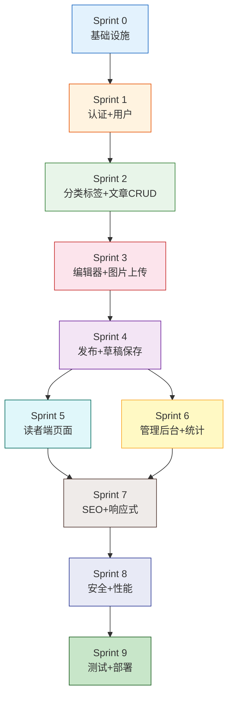

# 博客系统 Sprint 开发路线图

**文档版本：** v1.0  
**撰写日期：** 2026-06-27  
**撰写人：** Scrum Master  
**文档状态：** 待评审  
**依赖文档：** PRD / Architecture / Database / API / UI/UX 全系列 v1.0  

---

## 目录

1. [Sprint 规划总览](#1-sprint-规划总览)
2. [Sprint 0 — 基础设施搭建](#2-sprint-0--基础设施搭建)
3. [Sprint 1 — 认证与用户体系](#3-sprint-1--认证与用户体系)
4. [Sprint 2 — 分类标签与文章 CRUD](#4-sprint-2--分类标签与文章-crud)
5. [Sprint 3 — 编辑器与图片上传](#5-sprint-3--编辑器与图片上传)
6. [Sprint 4 — 发布流程与草稿保存](#6-sprint-4--发布流程与草稿保存)
7. [Sprint 5 — 读者端核心页面](#7-sprint-5--读者端核心页面)
8. [Sprint 6 — 管理后台与阅读统计](#8-sprint-6--管理后台与阅读统计)
9. [Sprint 7 — SEO 与响应式适配](#9-sprint-7--seo-与响应式适配)
10. [Sprint 8 — 安全加固与性能优化](#10-sprint-8--安全加固与性能优化)
11. [Sprint 9 — 集成测试与部署上线](#11-sprint-9--集成测试与部署上线)
12. [依赖关系图](#12-依赖关系图)
13. [风险总览与缓解策略](#13-风险总览与缓解策略)
14. [里程碑与验收关卡](#14-里程碑与验收关卡)

---

## 1. Sprint 规划总览

### 1.1 规划原则

| 原则 | 说明 |
|------|------|
| **每周交付** | 每个 Sprint 1 周，产出可验证的功能增量 |
| **纵向切片** | 每个 Sprint 尽量交付一个完整的用户故事（从 DB → API → UI） |
| **风险前置** | 高风险项（认证、编辑器、OSS）优先安排 |
| **依赖驱动** | 后续 Sprint 不依赖未完成的前序功能 |
| **缓冲留白** | 每个 Sprint 预留 10% 时间处理意外和优化 |

### 1.2 Sprint 总览表

| Sprint | 周次 | 开发目标 | P0 功能覆盖 | 预计工时 |
|--------|------|---------|------------|---------|
| **S0** | W1 | 基础设施搭建 | — | 40h |
| **S1** | W2 | 认证与用户体系 | #1 注册/登录 | 40h |
| **S2** | W3 | 分类标签与文章 CRUD | #7 分类与标签（后端） | 40h |
| **S3** | W4 | 编辑器与图片上传 | #3 编辑器 + #4 图片上传 | 48h |
| **S4** | W5 | 发布流程与草稿保存 | #5 草稿保存 + #6 发布/取消 | 40h |
| **S5** | W6 | 读者端核心页面 | #8 文章列表+详情 | 48h |
| **S6** | W7 | 管理后台与阅读统计 | #11 阅读统计 + #14 管理后台 | 40h |
| **S7** | W8 | SEO 与响应式适配 | #9 归档页 + #10 移动端 + #12 Sitemap + #13 RSS | 48h |
| **S8** | W9 | 安全加固与性能优化 | —（横切关注点） | 40h |
| **S9** | W10 | 集成测试与部署上线 | 全量验收 | 40h |

**MVP 总工期：10 周（≈ 2.5 个月）**

### 1.3 MVP P0 功能映射

| # | P0 功能 | 覆盖 Sprint | 说明 |
|---|--------|------------|------|
| 1 | 邮箱注册/登录 | S1 | Auth 模块核心 |
| 2 | 个人主页设置（头像/简介） | S1 + S5 | S1 后端，S5 前端页面 |
| 3 | Markdown 编辑器（含代码高亮） | S3 | 最复杂前端组件 |
| 4 | 图片上传 | S3 | Upload + OSS 集成 |
| 5 | 草稿自动保存 | S4 | 30s 定时 + localStorage 兜底 |
| 6 | 文章发布/取消发布 | S4 | Article publish/unpublish 流程 |
| 7 | 文章分类与标签 | S2 + S4 | S2 后端 CRUD，S4 发布时关联 |
| 8 | 文章列表页 + 详情页 | S5 | 读者端核心阅读路径 |
| 9 | 分类/标签归档页 | S7 | 归档与内容发现 |
| 10 | 移动端响应式设计 | S7 | 6 断点适配 |
| 11 | 文章阅读量统计 | S6 | Redis INCR + 每日归档 |
| 12 | 自动生成 sitemap.xml | S7 | 发布触发异步生成 |
| 13 | RSS Feed | S7 | 动态生成 + 5 分钟缓存 |
| 14 | 文章管理后台（列表/删除） | S6 | 管理端 CRUD |

---

## 2. Sprint 0 — 基础设施搭建

### 开发目标

搭建项目骨架和开发环境，让团队从 Sprint 1 开始即可编写业务代码。产出一个"空壳"应用：前端可启动、后端可连接数据库、Docker 一键拉起全栈。

### 功能列表

| # | 功能项 | 优先级 | 预计工时 |
|---|--------|--------|---------|
| 1 | Monorepo 项目初始化（Vite + React + NestJS） | P0 | 4h |
| 2 | Prisma Schema 定义（18 张表全量） | P0 | 6h |
| 3 | PostgreSQL + Redis + RabbitMQ Docker Compose | P0 | 4h |
| 4 | Prisma 迁移执行 + 种子数据（RBAC 5 角色 + 权限矩阵） | P0 | 4h |
| 5 | NestJS 项目骨架（模块结构 + DI + Config） | P0 | 4h |
| 6 | React 项目骨架（MUI + Zustand + Tailwind + Router） | P0 | 4h |
| 7 | 基础 MUI 主题配置（Primary #2563EB + Design System 变量） | P1 | 3h |
| 8 | ESLint + Prettier + Husky + lint-staged | P0 | 2h |
| 9 | GitHub Actions CI 流水线（Lint + Type Check + Build） | P1 | 3h |
| 10 | 环境配置管理（.env + config module） | P0 | 2h |
| 11 | API 通用模块（Response格式 + ErrorFilter + PaginationDto） | P0 | 4h |

### 风险

| 风险 | 概率 | 影响 | 缓解措施 |
|------|------|------|---------|
| Prisma 与 PG 版本兼容问题 | 中 | 高 | 提前验证 Prisma 5.x + PG 16 组合 |
| Docker Compose 网络配置问题 | 低 | 中 | 使用官方 Compose 模板，按文档配置 |
| 前端构建工具链版本冲突 | 低 | 低 | 锁定 package.json 版本号 |

### 验收标准

- [ ] `docker-compose up` 一键启动 PG + Redis + RabbitMQ，健康检查通过
- [ ] `prisma migrate deploy` 成功创建 18 张表 + 种子数据
- [ ] 前端 `npm run dev` 启动后显示空白 Layout 页（MUI 主题生效）
- [ ] 后端 `npm run start:dev` 启动后 `/api/v1/health` 返回 `{ status: "ok" }`
- [ ] CI 流水线在 Push 时自动运行 Lint + Type Check + Build
- [ ] 所有配置通过 `.env` 管理，无硬编码值

### 预计工时

**40 小时**（1 人 × 5 天 或 2 人 × 2.5 天）

---

## 3. Sprint 1 — 认证与用户体系

### 开发目标

完成用户注册、登录、Token 刷新全流程，以及用户资料管理后端。这是所有后续功能的前置依赖——没有认证就没有作者身份。

### 功能列表

| # | 功能项 | 优先级 | 预计工时 |
|---|--------|--------|---------|
| 1 | Auth 注册 API（邮箱+密码+验证邮件） | P0 | 6h |
| 2 | Auth 登录 API（JWT 双 Token 生成） | P0 | 6h |
| 3 | Auth Token 刷新 API（Refresh Token → 新 Access Token） | P0 | 4h |
| 4 | Auth 登出 API（Revoke Refresh Token） | P0 | 2h |
| 5 | Auth 密码重置 API（发送重置邮件 + 重置确认） | P1 | 4h |
| 6 | Auth 登录失败锁定（5 次/15 分钟，Redis 计数） | P0 | 2h |
| 7 | JwtAuthGuard + RolesGuard 实现 | P0 | 4h |
| 8 | User `/me` GET/PATCH API（资料读写） | P0 | 4h |
| 9 | Social Links CRUD API | P1 | 3h |
| 10 | 验证邮件发送（RabbitMQ + SMTP） | P0 | 4h |
| 11 | 登录/注册 UI 页面（Tab 切换 + 表单校验） | P0 | 5h |

### 风险

| 风险 | 概率 | 影响 | 缓解措施 |
|------|------|------|---------|
| JWT 双 Token 前后端联调复杂 | 中 | 高 | 先实现单 Token 方案，Sprint 末尾升级双 Token |
| SMTP 邮件服务不稳定 | 中 | 中 | 使用阿里云邮件推送服务，备用 Resend |
| HttpOnly Cookie 跨域配置 | 中 | 中 | CORS + SameSite=Strict 严格配置，提前测试 |

### 验收标准

- [ ] 注册流程：邮箱注册 → 收到验证邮件 → 点击链接激活 → 自动登录跳转
- [ ] 登录流程：邮箱+密码登录 → 返回 Access Token + Refresh Token Cookie → 前端拿到 Token
- [ ] Token 刷新：Access Token 过期后自动调用 `/auth/refresh` → 无感续期
- [ ] 登录失败 5 次 → 15 分钟锁定 → 提示"账号暂时锁定"
- [ ] `GET /me` 返回完整用户资料，`PATCH /me` 可修改 blog_name/bio/avatar
- [ ] 注册/登录 UI 页面正常交互，表单校验生效

### 预计工时

**40 小时**

---

## 4. Sprint 2 — 分类标签与文章 CRUD

### 开发目标

完成分类、标签和文章的后端 CRUD API，为编辑器和发布流程铺路。此 Sprint 专注后端 + 管理端基础 UI，读者端页面留给后续 Sprint。

### 功能列表

| # | 功能项 | 优先级 | 预计工时 |
|---|--------|--------|---------|
| 1 | Category CRUD API（作者维度隔离） | P0 | 4h |
| 2 | Tag CRUD API（全局共享 + usage_count 维护） | P0 | 4h |
| 3 | Article Create API（草稿创建） | P0 | 4h |
| 4 | Article Update API（草稿编辑） | P0 | 4h |
| 5 | Article Delete API（软删除） | P0 | 2h |
| 6 | Article-Tag 关联 API（多选，最多5个） | P0 | 3h |
| 7 | Slug 生成逻辑（中文拼音 + 唯一性校验） | P0 | 3h |
| 8 | OwnerGuard 实现（资源所有权校验） | P0 | 3h |
| 9 | 文章列表 API（管理端，OFFSET 分页 + 状态筛选） | P0 | 4h |
| 10 | 文章详情 API（管理端，by id） | P0 | 2h |
| 11 | 分类管理 UI 页面 | P1 | 4h |
| 12 | 标签管理 UI 页面 | P1 | 3h |
| 13 | "我的文章"列表 UI 页面 | P1 | 4h |

### 风险

| 雨险 | 概率 | 影响 | 缓解措施 |
|------|------|------|---------|
| Slug 中文转拼音库兼容性 | 低 | 中 | 使用 pinyin-pro 库，提前验证 |
| Article-Tag 关联事务一致性 | 低 | 高 | 使用 Prisma 事务包裹关联操作 |
| OwnerGuard 与 RolesGuard 组合逻辑 | 中 | 中 | 编写单元测试验证权限链 |

### 验收标准

- [ ] 作者可创建/编辑/删除自己的分类（其他作者分类不可见）
- [ ] 标签全局共享，创建时自动生成 slug + usage_count=0
- [ ] 创建草稿 → 编辑内容 → 保存 → 状态为 `draft`，category_id 可空
- [ ] 同一作者不同文章 slug 不可重复，中文标题自动转拼音
- [ ] 文章关联标签 ≤ 5 个，usage_count 随关联自动 ±1
- [ ] 非作者无法操作别人的分类/文章（OwnerGuard 拦截）

### 预计工时

**40 小时**

---

## 5. Sprint 3 — 编辑器与图片上传

### 开发目标

交付核心创作体验——Markdown 编辑器 + 图片上传。这是产品最复杂的前端组件，也是技术博主的核心场景。

### 功能列表

| # | 功能项 | 优先级 | 预计工时 |
|---|--------|--------|---------|
| 1 | Markdown 编辑器组件（左编辑/右预览分栏） | P0 | 10h |
| 2 | react-markdown + remark-gfm 渲染配置 | P0 | 4h |
| 3 | Prism.js 代码高亮集成（8+语言按需加载） | P0 | 4h |
| 4 | 编辑器工具栏（加粗/斜体/链接/代码/列表/引用） | P0 | 4h |
| 5 | Upload API（服务端代理上传 → OSS） | P0 | 4h |
| 6 | 图片拖拽上传（编辑器内拖拽 → 上传 → 插入 Markdown） | P0 | 4h |
| 7 | 图片点击上传（工具栏按钮 → 文件选择 → 上传） | P0 | 2h |
| 8 | 上传进度条 + 失败提示 | P1 | 2h |
| 9 | Upload 安全校验（MIME + magic bytes + 大小限制） | P0 | 3h |
| 10 | OSS SDK 集成（阿里云 OSS Node.js SDK） | P0 | 3h |
| 11 | 编辑区与预览区滚动同步 | P1 | 3h |
| 12 | 全屏编辑模式 | P1 | 2h |
| 13 | 字数统计 + 阅读时间估算（状态栏） | P1 | 2h |

### 风险

| 风险 | 概率 | 影响 | 缓解措施 |
|------|------|------|---------|
| 编辑器渲染性能（长文章卡顿） | 中 | 高 | 虚拟滚动或分段渲染；Prism.js 按需加载 |
| OSS SDK 配置与权限 | 中 | 高 | 提前申请阿里云 OSS + RAM 子账号，验证 STS |
| 拖拽上传浏览器兼容性 | 低 | 中 | 使用 react-dropzone 库，兼容性已验证 |
| 图片上传 XSS（恶意文件伪装） | 中 | 高 | magic bytes 校验 + MIME 白名单 + OSS 禁执行 |

### 验收标准

- [ ] 左侧输入 Markdown → 右侧实时渲染 HTML，延迟 < 100ms
- [ ] 代码块指定语言后渲染语法高亮，至少支持 JS/TS/Python/Java/Go/Shell/SQL/HTML/CSS
- [ ] 图片拖入编辑区 → 上传进度条 → 成功后自动插入 ``
- [ ] 图片格式限制：JPG/PNG/GIF/WebP，超 5MB 提示错误
- [ ] 工具栏按钮点击 → 在光标位置插入对应 Markdown 语法
- [ ] 全屏模式切换正常，字数/阅读时间实时显示
- [ ] 上传文件 MIME 校验通过，伪造文件被拒绝

### 预计工时

**48 小时**（本周最重的 Sprint，可调配 2 名前端并行）

---

## 6. Sprint 4 — 发布流程与草稿保存

### 开发目标

打通"创作 → 发布"完整链路：自动保存防止丢失、发布配置面板、取消发布。至此作者可以在系统内完成从写作到发布的全流程。

### 功能列表

| # | 功能项 | 优先级 | 预计工时 |
|---|--------|--------|---------|
| 1 | 草稿自动保存 API（30s 定时 PUT，轻量更新） | P0 | 4h |
| 2 | localStorage 兜底存储（断网时本地保存） | P0 | 4h |
| 3 | 恢复草稿提示 UI（重新进入编辑器时） | P1 | 2h |
| 4 | Article Publish API（校验必填字段 + 状态变更） | P0 | 4h |
| 5 | Article Unpublish API（published → draft） | P0 | 2h |
| 6 | 发布配置面板 UI（侧边栏：标题/摘要/封面/分类/标签） | P0 | 6h |
| 7 | Slug 手动修改（发布前可编辑） | P1 | 2h |
| 8 | 摘要自动截取（不填时取正文前150字） | P1 | 2h |
| 9 | 封面图选择（从正文图片或上传新图） | P1 | 3h |
| 10 | 发布触发异步任务（RabbitMQ → ES索引 + Sitemap） | P1 | 4h |
| 11 | 保存状态指示器 UI（"正在保存..." → "已保存 19:38"） | P1 | 2h |
| 12 | 文章详情管理端 API（by id，含全字段） | P0 | 2h |
| 13 | 版本号自动递增（每次 publish version+1） | P1 | 2h |
| 14 | 冗余字段同步（comment_count/like_count/category_name/author_name） | P1 | 2h |

### 风险

| 风险 | 概率 | 影响 | 缓解措施 |
|------|------|------|---------|
| 自动保存并发冲突（多标签页编辑） | 低 | 高 | 使用 version 乐观锁，冲突时提示用户 |
| RabbitMQ 异步任务丢失 | 低 | 高 | 消息持久化 + 死信队列 + 重试机制 |
| 发布配置面板 UI 复杂度 | 中 | 中 | 先实现基础版（分类+标签），封面图和摘要作为增强 |

### 验收标准

- [ ] 编辑器输入内容 → 30秒后状态栏显示"已保存 xx:xx" → 刷新页面后内容恢复
- [ ] 断网时 localStorage 存储内容 → 恢复联网后自动同步到服务端
- [ ] 点击"发布" → 弹出配置面板 → 选择分类+标签 → 确认 → 文章状态变为 `published`
- [ ] 发布后 slug 生成且唯一，手动修改 slug 成功
- [ ] 点击"取消发布" → 文章回到 `draft` 状态，URL 不再可访问
- [ ] 发布触发异步队列消息（ES 索引 + Sitemap 任务入队）
- [ ] 冗余字段在发布时正确填充（category_name, author_name 等）

### 预计工时

**40 小时**

---

## 7. Sprint 5 — 读者端核心页面

### 开发目标

交付读者端核心阅读路径：首页文章列表 → 文章详情页 → 用户公开主页。至此博客具备了面向读者展示的基本能力。

### 功能列表

| # | 功能项 | 优先级 | 预计工时 |
|---|--------|--------|---------|
| 1 | 文章列表 API（读者端，Keyset 分页，不含 content） | P0 | 4h |
| 2 | 文章详情 API（读者端，by slug，含 content + Redis 缓存） | P0 | 4h |
| 3 | 用户公开主页 API（by username，不含 email） | P0 | 3h |
| 4 | 博客首页 UI（文章卡片列表 + 分页） | P0 | 6h |
| 5 | 文章详情页 UI（Markdown渲染 + 元信息 + 作者卡片） | P0 | 8h |
| 6 | 浮动目录（TOC）组件 | P1 | 4h |
| 7 | 阅读进度条组件 | P1 | 2h |
| 8 | 代码块一键复制按钮 | P1 | 2h |
| 9 | 用户公开主页 UI（头像+简介+社交链接+文章列表） | P0 | 4h |
| 10 | 全局导航栏（首页/分类/关于） | P0 | 3h |
| 11 | 页面底部 Footer（版权+RSS 链接） | P1 | 2h |
| 12 | DOMPurify XSS 过滤（Markdown渲染后清洗） | P0 | 3h |
| 13 | Redis 缓存集成（热点文章 5min + 列表 10min） | P0 | 3h |

### 风险

| 风险 | 概率 | 影响 | 缓解措施 |
|------|------|------|---------|
| 文章详情页渲染性能（超长文章） | 中 | 高 | content 查询走 Redis 缓存；DOMPurify 大 HTML 可能慢 |
| Keyset 分页前端实现复杂 | 中 | 中 | 封装通用 KeysetPagination 组件，cursor 替代 page |
| TOC 组件滚动同步 | 低 | 中 | 使用 IntersectionObserver API |

### 验收标准

- [ ] 首页加载 < 1.5s，显示 10 篇文章卡片（标题/摘要/标签/日期/阅读量）
- [ ] Keyset 分页：点击"下一页" → 加载下 10 篇，无跳页但无限滚动流畅
- [ ] 文章详情页 Markdown 正确渲染，代码块有语法高亮+复制按钮
- [ ] TOC 浮动目录随滚动高亮当前章节，点击锚点跳转
- [ ] 阅读进度条随滚动从 0% → 100%
- [ ] 用户公开主页显示博主信息 + 文章列表
- [ ] DOMPurify 清除 `<script>` 和危险标签，无 XSS 漏洞
- [ ] 热点文章 Redis 缓存生效，第二次访问响应 < 50ms

### 预计工时

**48 小时**

---

## 8. Sprint 6 — 管理后台与阅读统计

### 开发目标

完成管理后台核心功能 + 阅读量统计。至此作者可以管理文章、查看数据，管理员可以审核内容。

### 功能列表

| # | 功能项 | 优先级 | 预计工时 |
|---|--------|--------|---------|
| 1 | Admin Dashboard API（文章数/用户数/阅读总量） | P0 | 4h |
| 2 | Admin 文章管理 API（列表+筛选+搜索+批量操作） | P0 | 4h |
| 3 | Admin 用户管理 API（列表+冻结+角色变更） | P1 | 4h |
| 4 | 阅读量记录 API（Redis INCR + IP+UA 去重） | P0 | 4h |
| 5 | 阅读量每日归档（定时任务 Redis → PG） | P0 | 4h |
| 6 | 阅读趋势 API（最近30天按天统计） | P0 | 3h |
| 7 | 管理后台 Layout（侧边栏+顶栏+面包屑） | P0 | 4h |
| 8 | 管理首页 UI（统计卡片 + 最近文章列表） | P0 | 4h |
| 9 | 文章管理列表 UI（表格+筛选+搜索+快捷操作） | P0 | 6h |
| 10 | 数据统计概览 UI（折线图 + 阅读量排行） | P0 | 4h |
| 11 | 个人资料设置 UI（博客名称/简介/头像/社交链接） | P0 | 3h |
| 12 | 未读通知数 API + 通知列表 API | P1 | 3h |
| 13 | 通知中心 UI（列表 + 标记已读） | P1 | 3h |

### 风险

| 风险 | 概率 | 影响 | 缓解措施 |
|------|------|------|---------|
| 阅读量去重逻辑复杂（IP+UA 24h窗口） | 中 | 中 | Redis SET 存储每日访问标识，定时过期清理 |
| 定时归档任务与 PG 写入冲突 | 低 | 中 | 使用 ON CONFLICT DO UPDATE 累加 |
| 管理后台 UI 组件多 | 中 | 低 | 使用 MUI DataGrid/Charts 等现成组件 |

### 验收标准

- [ ] 管理首页显示：总文章数/草稿数/总阅读量/今日阅读量
- [ ] 文章管理列表：按标题搜索 + 状态筛选 + 每页20条 + 编辑/查看/删除快捷操作
- [ ] 批量删除文章（多选 → 确认 → 软删除）
- [ ] 阅读量：同一 IP 24h 内多次访问同一文章只计 1 次
- [ ] 阅读趋势折线图显示最近 30 天数据
- [ ] 个人资料设置页可修改 blog_name/bio/avatar/社交链接
- [ ] 通知列表显示评论通知，可标记已读

### 预计工时

**40 小时**

---

## 9. Sprint 7 — SEO 与响应式适配

### 开发目标

完成 SEO 基础能力（Sitemap + RSS）和分类/标签归档页，并做全站响应式适配。至此博客在搜索引擎可被发现，且移动端可正常阅读。

### 功能列表

| # | 功能项 | 优先级 | 预计工时 |
|---|--------|--------|---------|
| 1 | Sitemap 生成服务（发布触发异步生成） | P0 | 4h |
| 2 | Sitemap XML 输出端点（`/{username}/sitemap.xml`） | P0 | 2h |
| 3 | RSS Feed 生成（`/{username}/rss.xml`，最近20篇） | P0 | 4h |
| 4 | 分类归档 API（按分类筛选文章列表） | P0 | 3h |
| 5 | 标签归档 API（按标签筛选文章列表） | P0 | 3h |
| 6 | 分类归档页 UI（分类列表 + 文章列表） | P0 | 4h |
| 7 | 标签归档页 UI（标签云 + 文章列表） | P0 | 4h |
| 8 | 搜索结果页 API（PG tsvector 全文搜索 MVP） | P1 | 6h |
| 9 | 搜索结果页 UI | P1 | 4h |
| 10 | 全站响应式适配（xs 375 → xl 1440） | P0 | 8h |
| 11 | 移动端导航栏（折叠菜单） | P0 | 3h |
| 12 | 移动端文章详情页优化 | P0 | 3h |
| 13 | 忘记密码页 UI | P1 | 2h |

### 风险

| 风险 | 概率 | 影响 | 缓解措施 |
|------|------|------|---------|
| pg_jieba/zhparser 中文分词扩展安装 | 中 | 高 | Docker 镜像预装扩展；如不可用，降级为 LIKE 搜索 |
| 响应式适配范围广 | 中 | 中 | 按页面优先级：详情页 > 首页 > 编辑器 > 后台 |
| Sitemap 生成性能（大量文章） | 低 | 中 | 异步生成 + 文件缓存，不实时查询 |

### 验收标准

- [ ] `/{username}/sitemap.xml` 返回合法 XML，包含所有已发布文章 URL + lastmod + priority
- [ ] `/{username}/rss.xml` 返回 RSS 2.0 格式 Feed，包含最近 20 篇文章
- [ ] 分类归档页：点击分类 → 展示该分类下所有已发布文章
- [ ] 标签归档页：标签云展示 → 点击标签 → 展示相关文章
- [ ] 搜索结果页：输入关键词 → 返回匹配文章列表（标题权重 > 正文权重）
- [ ] iPhone SE (375px) 到 Desktop (1440px) 所有页面正常显示，无布局错乱
- [ ] 移动端导航栏折叠展开正常，文章详情页字号/行高适配
- [ ] Sitemap 在文章发布后 5 分钟内更新

### 预计工时

**48 小时**

---

## 10. Sprint 8 — 安全加固与性能优化

### 开发目标

全站安全加固（Rate Limit、CSP、CSRF）和性能优化（缓存策略完善、N+1 查询消除）。此 Sprint 是横切关注点，不新增 P0 功能，但确保产品可安全上线。

### 功能列表

| # | 功能项 | 优先级 | 预计工时 |
|---|--------|--------|---------|
| 1 | Rate Limit 实现（NestJS ThrottlerGuard + Redis） | P0 | 6h |
| 2 | Rate Limit 端点配置（登录5/15min, 注册3/h, 评论5/min 等） | P0 | 3h |
| 3 | CSP Header 配置（Nginx） | P0 | 2h |
| 4 | HSTS + HTTPS 强制（Nginx） | P0 | 2h |
| 5 | CORS 严格白名单配置 | P0 | 2h |
| 6 | bcrypt 密码存储验证（cost=12） | P0 | 1h |
| 7 | N+1 查询消除（Prisma include 优化） | P0 | 4h |
| 8 | 文章列表查询优化（排除 content 大字段） | P0 | 2h |
| 9 | Redis 缓存策略完善（主动失效 + 预热） | P0 | 4h |
| 10 | 前端性能优化（代码分割 + 懒加载） | P1 | 4h |
| 11 | 图片 CDN 配置 | P1 | 2h |
| 12 | 操作日志记录（关键操作写入 operation_logs） | P0 | 4h |
| 13 | 媒体库管理 UI（图片列表 + 删除） | P1 | 4h |

### 风险

| 风险 | 概率 | 影响 | 缓解措施 |
|------|------|------|---------|
| Rate Limit 影响正常用户体验 | 低 | 中 | 限流值参考行业标准，上线后监控调整 |
| CSP 配置过严阻塞资源加载 | 中 | 中 | 分步收紧：先 report-only，再 enforce |
| 缓存失效策略遗漏 | 低 | 中 | 发布/更新/删除时统一失效相关缓存 Key |

### 验收标准

- [ ] 登录接口 5 次/15分钟限流生效，超限返回 429
- [ ] 注册接口 3 次/小时限流生效
- [ ] CSP Header 阻止内联脚本执行，不阻塞正常资源加载
- [ ] HTTPS 强制：HTTP 请求 301 重定向到 HTTPS
- [ ] 文章列表 API 不含 content 字段，响应体积 < 10KB
- [ ] 热点文章缓存命中率 > 80%
- [ ] 前端首屏 JS < 200KB（gzipped），Lighthouse Performance ≥ 85
- [ ] 关键操作（登录/发布/删除/角色变更）记录到 operation_logs

### 预计工时

**40 小时**

---

## 11. Sprint 9 — 集成测试与部署上线

### 开发目标

全量集成测试 + 生产环境部署 + MVP 上线。零 P0 Bug 上线是硬性指标。

### 功能列表

| # | 功能项 | 优先级 | 预计工时 |
|---|--------|--------|---------|
| 1 | E2E 测试：注册→登录→写文章→发布→阅读全流程 | P0 | 6h |
| 2 | E2E 测试：管理后台操作流程 | P0 | 4h |
| 3 | API 单元测试覆盖率 ≥ 60%（核心模块） | P0 | 6h |
| 4 | 前端组件测试（编辑器/文章列表/管理页面） | P1 | 4h |
| 5 | Bug 修复（测试发现的缺陷） | P0 | 8h |
| 6 | Docker 生产配置（多阶段构建 + 健康检查） | P0 | 4h |
| 7 | Nginx 生产配置（反向代理 + SSL + Gzip） | P0 | 3h |
| 8 | 生产环境部署（服务器配置 + 环境变量） | P0 | 3h |
| 9 | 数据库备份策略（PG 定时备份） | P0 | 2h |
| 10 | 上线前 Checklist 逐项验证 | P0 | 2h |
| 11 | Lighthouse 性能评分验证（≥ 85） | P0 | 2h |
| 12 | 监控配置（Prometheus + Grafana 基础面板） | P1 | 3h |

### 风险

| 风险 | 概率 | 影响 | 缓解措施 |
|------|------|------|---------|
| 测试发现大量 Bug 延期上线 | 中 | 高 | Sprint 8 预留 buffer；Sprint 9 Bug 修复时间 8h 充裕 |
| 生产环境配置差异 | 中 | 中 | Docker 统一环境 + 配置验证脚本 |
| SSL 证书申请延迟 | 低 | 中 | 提前在 Sprint 8 申请证书 |

### 验收标准

- [ ] 注册→登录→写文章→发布→阅读→取消发布 全流程 E2E 测试通过
- [ ] 管理后台操作 E2E 测试通过
- [ ] API 单元测试覆盖率 ≥ 60%，所有核心模块测试通过
- [ ] **0 个 P0 级 Bug**（硬性指标）
- [ ] 生产环境部署成功，`docker-compose up` 全栈启动
- [ ] HTTPS + SSL 证书生效
- [ ] Lighthouse Performance ≥ 85，首屏 < 2s
- [ ] PG 定时备份 cron 任务配置生效
- [ ] 5 分钟内完成注册+发布第一篇文章（MVP 成功标准）

### 预计工时

**40 小时**

---

## 12. 依赖关系图

**关键依赖说明**：

| 依赖 | 说明 |
|------|------|
| S0 → 全部 | 基础设施是所有 Sprint 的地基 |
| S1 → S2~S9 | 认证是所有业务操作的前置条件 |
| S2 → S3 | 文章 CRUD API 先完成，编辑器才能对接 |
| S3 → S4 | 编辑器 + 图片上传完成后才能谈发布流程 |
| S4 → S5 + S6 | 发布流程完成后，读者端和管理端才有数据展示 |
| S5 + S6 → S7 | 页面完成后才能做响应式适配 |
| S7 → S8 | 功能完成后做安全加固（横切） |
| S8 → S9 | 安全加固后才能上线 |

**并行机会**：

| 并行组 | 说明 |
|--------|------|
| S5 + S6 可并行 | 读者端和管理后台互不依赖，可双线并行 |
| S8 可穿插 | 安全加固可在 S5~S7 期间逐步植入，不必集中到 S8 |

---

## 13. 风险总览与缓解策略

### 13.1 全局高风险项

| # | 风险 | 概率 | 影响 | 首现 Sprint | 缓解策略 |
|---|------|------|------|------------|---------|
| 1 | **Markdown 编辑器性能瓶颈** | 中 | 高 | S3 | 虚拟滚动 + Prism 按需加载 + 长文分段渲染 |
| 2 | **JWT 双 Token 前后端联调** | 中 | 高 | S1 | 先单 Token 验证流程，Sprint 末升级双 Token |
| 3 | **OSS 上传安全与权限** | 中 | 高 | S3 | 提前配置 RAM 子账号 + STS；magic bytes 校验 |
| 4 | **中文全文搜索分词** | 中 | 高 | S7 | Docker 镜像预装 pg_jieba；降级为 LIKE 搜索 |
| 5 | **SMTP 邮件服务可靠性** | 中 | 中 | S1 | 使用阿里云邮件推送 + Resend 备用 |
| 6 | **测试 Bug 延期上线** | 中 | 高 | S9 | S8 预留 buffer；分批上线策略 |

### 13.2 缓解原则

- **风险前置**：高风险项集中在 S1~S3，越早暴露越好
- **降级方案**：每个高风险项都有"降级路径"（如 tsvector → LIKE, 双Token → 单Token）
- **Buffer 留白**：S3 和 S5 预计 48h（比标准 40h 多 8h buffer），S9 预留 8h Bug 修复
- **逐步植入**：安全加固不必等 S8，Rate Limit 和 XSS 防护可在功能 Sprint 中提前植入

---

## 14. 里程碑与验收关卡

### 14.1 关键里程碑

| 里程碑 | 时间点 | Sprint | 验收内容 |
|--------|--------|--------|---------|
| **M1 — 可认证** | W2 结束 | S1 | 用户可注册/登录/获取 Token |
| **M2 — 可写作** | W4 结束 | S3 | 作者可在编辑器写文章 + 上传图片 |
| **M3 — 可发布** | W5 结束 | S4 | 作者可发布文章，草稿自动保存 |
| **M4 — 可阅读** | W6 结束 | S5 | 读者可浏览文章列表和详情页 |
| **M5 — 可管理** | W7 结束 | S6 | 管理后台可用，阅读统计可见 |
| **M6 — 可发现** | W8 结束 | S7 | SEO + 移动端适配完成 |
| **M7 — 可上线** | W10 结束 | S9 | 零 P0 Bug，Lighthouse ≥ 85，生产部署 |

### 14.2 MVP 上线硬性指标

| 指标 | 目标值 | 验证方式 |
|------|--------|---------|
| P0 Bug 数 | **0** | 测试报告 |
| Lighthouse Performance | ≥ 85 | Chrome Lighthouse 工具 |
| 首屏加载时间 | < 2s（4G） | WebPageTest 测量 |
| 注册到发布时间 | < 5 分钟 | 人工计时验证 |
| API 响应时间 P95 | < 500ms | Prometheus 监控 |
| 测试覆盖率 | ≥ 60% | Jest/Vitest 覆盖率报告 |

---

*文档结束 · 如有疑问请联系 Scrum Master*

> 版本历史  
> v1.0 — 2026-06-27 — 初稿创建
